= K101 - Nodejs-Express
:author: Hafid Haddouti
:toc: left
:toclevels: 4

Kabanero 101 - nodejs-express example used for workshops

toc::[]

== Overview

This step-by-step instructions provides the explanation to use Kabanero (Appsody + Kabanero Collection + Kabanero Pipeline) to create a new application, build and deploy them into an OpenShift Cluster.

The main structure is that every steps contains the following sections

* Overview of the main steps
* Detailed step description with the commands
* Verification tasks if applicable
* Summary

== Steps

=== Prerequisites

* >OCPv4.3 with Kabanero 0.9
* link:https://mirror.openshift.com/pub/openshift-v4/clients/oc/latest/[OC CLI > 4.2]
* Appsody 0.6.5

For simplicity, expose the following env variables

.Env variables for entire workshop
----
# Kabanero Collection
export K_VERSION=0.10.2
# Appsody
export AS_VERSION=0.6.5
----

'''

=== Install Kabanero in OpenShift

Mostly Kabanero is already installed in the OpenShift cluster of the workshop.
Nevertheless here are the steps to install Kabanero in a new environment or to upgrade an old version.

[%collapsible]
====
Installation takes approx. 15min

.Install Kabanero
----
$ cd scripts
$ ./installKabanero.sh
+ RELEASE=0.9.2
+ KABANERO_SUBSCRIPTIONS_YAML=https://github.com/kabanero-io/kabanero-operator/releases/download/0.9.2/kabanero-subscriptions.yaml
+ KABANERO_CUSTOMRESOURCES_YAML=https://github.com/kabanero-io/kabanero-operator/releases/download/0.9.2/kabanero-customresources.yaml
+ SLEEP_LONG=5
+ SLEEP_SHORT=2
+ ENABLE_KAPPNAV=yes
+ MAC_EXEC=false
++ uname -s
+ '[' Darwin == Darwin ']'
+ MAC_EXEC=true
+ which oc
/usr/local/bin/oc
+ oc whoami
developer
+ OCMIN=4.2.0
...

**************************************************************************
*
*  The installation script is complete.  You can now create an instance
*  of the Kabanero CR.  If you have cloned and curated a collection set,
*  apply the Kabanero CR that you created.  Or, to create the default
*  instance:
*
*      oc apply -n kabanero -f https://github.com/kabanero-io/kabanero-operator/releases/download/0.9.2/default.yaml
*
***************************************************************************
  % Total    % Received % Xferd  Average Speed   Time    Time     Time  Current
                                 Dload  Upload   Total   Spent    Left  Speed
100   638  100   638    0     0   2122      0 --:--:-- --:--:-- --:--:--  2119
100   524  100   524    0     0    611      0 --:--:-- --:--:-- --:--:--   611
kabanero.kabanero.io/kabanero configured
----

====

=== Verify the Kabanero installation

This section verifies the Kabanero installation and highlights which resources are provided

* Kabanero Foundation
** Catalog
** Operators
** Kabanero CustomResource
* Pipeline definitions
* Task definitions
* Stacks
* Tekton Dashboard
* kAppNav (Dashboard)
* CodeReady Workspaces

[%collapsible]
====

For the Kabanero base the following resource objects are installed.
The `CatalogSource` holds the meta information from where the operator can be installed.

.Catalog Sources, for the main Kabanero operators
----
$ oc get catalogsource -A
NAMESPACE               NAME                  DISPLAY               TYPE   PUBLISHER     AGE
...
openshift-marketplace   kabanero-catalog      Kabanero Operators    grpc   kabanero.io   5h34m
...

----

The `Subscription` represents the intend to install a specific operator from a `CatalogSource` using a dedicated stream/`channel`.

.Subscriptions, represents the operators which are intended to be installed
----
$ oc get subscription -A
NAMESPACE             NAME                         PACKAGE                        SOURCE             CHANNEL
kabanero              codeready-workspaces         codeready-workspaces           redhat-operators   latest
kabanero              kabanero-operator            kabanero-operator              kabanero-catalog   release-0.9
openshift-operators   appsody-operator-certified   appsody-operator-certified     kabanero-catalog   kabanero-0.9
openshift-operators   elasticsearch-operator       elasticsearch-operator         redhat-operators   4.3
openshift-operators   jaeger-product               jaeger-product                 redhat-operators   stable
openshift-operators   kiali-ossm                   kiali-ossm                     redhat-operators   stable
openshift-operators   open-liberty-certified       open-liberty-certified         kabanero-catalog   kabanero-0.9
openshift-operators   openshift-pipelines          openshift-pipelines-operator   kabanero-catalog   kabanero-0.9
openshift-operators   serverless-operator          serverless-operator            redhat-operators   4.4
openshift-operators   servicemeshoperator          servicemeshoperator            redhat-operators   stable

----

With the `Subscription` and the version info an installation of the operator is planned and executed - represented with the `InstallPlan`.

.InstallPlan, the install
----
$ oc get installplan -A
NAMESPACE             NAME            CSV                                             APPROVAL    APPROVED
kabanero              install-qcs8j   kabanero-operator.v0.9.2                        Automatic   true
kabanero              install-xgxt9   crwoperator.v2.4.0                              Automatic   true
...
openshift-operators   install-n9tx2   appsody-operator.v0.5.1                         Automatic   true
...
----

The version information - beside other meta data - is stored in the `CusterServiceVersion`.

.Cluster Service Versions, for the running/installed operators
----
$ oc get csv -n kabanero
NAME                                            DISPLAY                          VERSION                  REPLACES   PHASE
appsody-operator.v0.5.1                         Appsody Operator                 0.5.1                               Succeeded
crwoperator.v2.4.0                              Red Hat CodeReady Workspaces     2.4.0                               Succeeded
elasticsearch-operator.4.3.40-202010141211.p0   Elasticsearch Operator           4.3.40-202010141211.p0              Succeeded
jaeger-operator.v1.17.6                         Red Hat OpenShift Jaeger         1.17.6                              Succeeded
kabanero-operator.v0.9.2                        Kabanero Operator                0.9.2                               Succeeded
kiali-operator.v1.12.16                         Kiali Operator                   1.12.16                             Succeeded
open-liberty-operator.v0.5.1                    Open Liberty Operator            0.5.1                               Succeeded
openshift-pipelines-operator.v0.11.2            OpenShift Pipelines Operator     0.11.2                              Succeeded
serverless-operator.v1.7.2                      OpenShift Serverless Operator    1.7.2                               Succeeded
servicemeshoperator.v1.1.10                     Red Hat OpenShift Service Mesh   1.1.10-0                            Succeeded

----

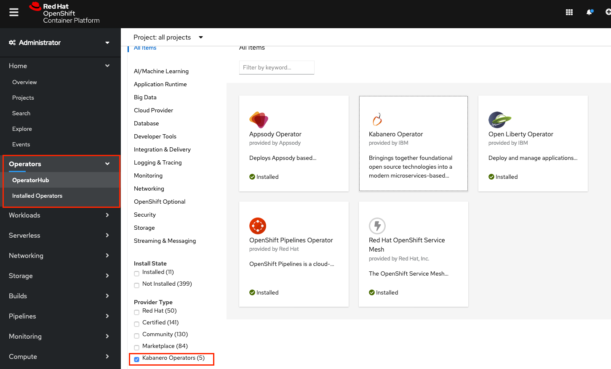

.Kabanero Custom Resource and the configured URLs for Pipeline and Stacks
---
$ oc get kabanero -n kabanero -o yaml | grep url:
    url: https://github.com/kabanero-io/kabanero-pipelines/releases/download/0.9.1/default-kabanero-pipelines.tar.gz
    url: https://github.com/kabanero-io/kabanero-stack-hub/releases/download/0.9.0/kabanero-stack-hub-index.yaml
---

For the different development and operation activities the following resources are relevant.

.Kabanero Pipelines
----
$ oc get pipeline -n kabanero
NAME                                AGE
build-pl-caf603b6                   27s
build-push-promote-pl-caf603b6      28s
deploy-kustomize-pl                 29s
image-retag-pl-caf603b6             28s
java-openliberty-build-deploy-pl    28h
java-openliberty-build-pl           28h
java-openliberty-build-push-jk-pl   28h
java-openliberty-build-push-pl      28h
java-openliberty-image-retag-pl     28h
nodejs-express-build-deploy-pl      28h
nodejs-express-build-pl             28h
nodejs-express-build-push-jk-pl     28h
nodejs-express-build-push-pl        28h
nodejs-express-image-retag-pl       28h
----

.Kabanero Tasks
----
$ oc get task -n kabanero
NAME                                   AGE
build-push-promote-task-caf603b6       2m26s
build-task-caf603b6                    2m26s
deploy-kustomize-task                  2m29s
deploy-task-caf603b6                   2m26s
image-retag-task-caf603b6              2m27s
image-scan-task-caf603b6               2m28s
java-openliberty-build-deploy-task     28h
java-openliberty-build-push-jk-task    28h
java-openliberty-build-push-task       28h
java-openliberty-build-task            28h
java-openliberty-deploy-task           28h
java-openliberty-image-retag-task      28h
java-openliberty-image-scan-task       28h
java-openliberty-validate-stack-task   28h
monitor-task-caf603b6                  2m27s
nodejs-express-build-deploy-task       28h
nodejs-express-build-push-jk-task      28h
nodejs-express-build-push-task         28h
nodejs-express-build-task              28h
nodejs-express-deploy-task             28h
nodejs-express-image-retag-task        28h
nodejs-express-image-scan-task         28h
nodejs-express-validate-stack-task     28h
----

.Kabanero Stacks
----
$ oc get stack -n kabanero
NAME                AGE     SUMMARY
java-openliberty    18h    [ 0.2.12: active ]
java-spring-boot2   3d2h   [ 0.3.29: active ]
nodejs              3d2h   [ 0.3.6: active ]
nodejs-express      18h    [ 0.4.8: active ]
quarkus             3d2h   [ 0.3.6: active ]
----

.Kabanero Collections
----
$ oc get collections -A
No resources found
----

For operation and maintenance verify the following resources.

.Kabanero Landing page, the overall management console with also reference to other components
----
$ oc get route -n kabanero kabanero-landing --template='http://{{.spec.host}}'
http://kabanero-landing-kabanero.apps.cluster-3e01.sandbox134.opentlc.com
----

.Tekton dashboard (deprecated)
----
$ oc get route -n tekton-pipelines tekton-dashboard --template='http://{{.spec.host}}'
http://tekton-dashboard-tekton-pipelines.apps.cluster-3e01.sandbox134.opentlc.com
----

.kAppNav 
----
$ oc get route -n kappnav kappnav-ui-service --template='http://{{.spec.host}}'
http://kappnav-ui-service-kappnav.apps.cluster-3e01.sandbox134.opentlc.com
----

This are the most relevant resources for a proper Kabanero installation.

====

=== Install and configure CodeReady Workspaces

Kabanero installs also the link:https://developers.redhat.com/products/codeready-workspaces/overview/[`Red Hat CodeReady Workspaces`], a Kubernetes-native IDE providing all known capabilities for modern/cloud-native development, totally running in a Kubernetes cluster.

To use and enable this IDE is a re-configuration of the `Kabanero` CR necessary. The following instruction explains the steps, generally this is already done for a workshop session.

[%collapsible]
====

.Edit Kabanero CR and enable codeReadyWorkspaces
----
$ oc edit kabanero -n kabanero

apiVersion: kabanero.io/v1alpha2
kind: Kabanero
metadata:  
  name: kabanero
  namespace: kabanero  
spec:
  admissionControllerWebhook: {}
  cliServices: {}
  # #################
  # Enable CodeReadyWorkspaces, also configure OAuth, TLS and Self-Signed Certs - if needed
  codeReadyWorkspaces:
    enable: true
    operator:
      customResourceInstance:
        tlsSupport: true
        selfSignedCert: true
        openShiftOAuth: true
        devFileRegistryImage: {}
  collectionController: {}
  events: {}
  github: {}
  gitops: {}
  governancePolicy: {}
  landing: {}
  sso: {}
  stackController: {}
  stacks:
    pipelines:
    - https:
        url: https://github.com/kabanero-io/kabanero-pipelines/releases/download/0.9.1/kabanero-events-pipelines.tar.gz
      id: default
      sha256: caf603b69095ec3d128f1c2fa964a2964509854e306fb3c5add8addc8f7f7b71
    repositories:
    - https:
        url: https://github.com/kabanero-io/kabanero-stack-hub/releases/download/0.9.0/kabanero-stack-hub-index.yaml
      name: central
  version: 0.9.2
status:
  ...

----

Ensure to set the following fields to true

* `spec.codeReadyWorkspaces.enable`
* `spec.codeReadyWorkspaces.operator.customResourceInstance.tlsSupport`
* `spec.codeReadyWorkspaces.operator.customResourceInstance.selfSignedCert`
* `spec.codeReadyWorkspaces.operator.customResourceInstance.openShiftOAuth`

NOTE: Modify the CR via command line and not via Webconsole because this could change the version, but `kabanero.io/v1alpha2` is mandatory.

After a while a `CodeReady Workspaces Cluster` will be created (approx. 10-15min)

.CodeReady Workspaces Cluster instance and URL
----
$ oc get checluster -n kabanero
NAME                   AGE
codeready-workspaces   18m

$ oc get route -n kabanero codeready --template='http://{{.spec.host}}'
http://codeready-kabanero.apps.cluster-3e01.sandbox134.opentlc.com
----

NOTE: In case of self signed cert, link:https://access.redhat.com/documentation/en-us/red_hat_codeready_workspaces/2.4/html-single/end-user_guide/index#importing-certificates-to-browsers_crw[see how to import the cert] in the browser.

Now only a workspace with the Codewind plugin is missing. For this the following steps are necessary

* Open CodeReady Workspace using the above URL
* In most cases the dashboard provides a button for installing a `Codewind` workspace, use this one, otherwise
* Create a workspace and select the devfile template `Codewind`

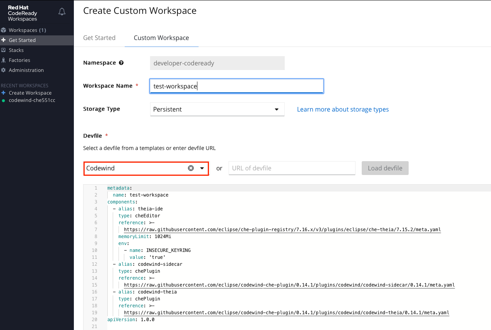

Due Codewind needs root access to run execute the following scc

----
$ oc adm policy add-scc-to-user anyuid system:serviceaccounts:kabanero:che-workspace
clusterrole.rbac.authorization.k8s.io/system:openshift:scc:anyuid added: "system:serviceaccounts:kabanero:che-workspace"

$ oc adm policy add-scc-to-user privileged system:serviceaccounts:kabanero:che-workspace
clusterrole.rbac.authorization.k8s.io/system:openshift:scc:privileged added: "system:serviceaccounts:kabanero:che-workspace"
----

Additionally Codewind needs a persistent volume with `ReadWriteMany` access mode and will use the default storageClass in the cluster to request a PV(C). Ensure, that the default storageClass can handle such kind of requests.

NOTE: Safari is not supported with CodeReady Workspaces. Use Firefox or Chrome.

====

==== Configure CodeReady Workspaces to use private Git repos

To access private git repository with SSH key follow for a detailed instruction the link:https://access.redhat.com/documentation/en-us/red_hat_codeready_workspaces/2.4/html-single/end-user_guide/index#accessing-a-git-repository-via-ssh_crw[End-User-Guide].

In short

.In CodeReady Workspaces
* Press `F1` to open the `Find Command...` wizard
* Search for `SSH: generate key pair for particular host`, `Enter`
* Enter the hostname like `github.com`
* At the bottom click on `View` to get the public key

.In GitHub
* In User menu select `Settings` then `SSH and GPG keys`
* Press `New SSH key`
* Enter title and the public key

Now any git action to this hostname will use the SSH key.
To re-use this for all workspaces, restart the workspaces.

In case you need the ssh public key again

* `F1` and `SSH: view public key...`

The key will be stored on the volume.

NOTE: Do not forget to set `user.name` and `user.email`

.Configure user name and email in CodeReady Workspaces
* In Workspaces select in the directory `Plugins` the `theia` plugin
* ...open a `New Terminal`
* Set the git config parameters
** `git config --global user.name "Your Name"`
** `git config --global user.email your@mail.com`

Now you can e.g. clone a private repository in your CodeReady Workspaces

* `F1`
* Search for `git clone`, `Enter`
* Enter the repo URL like `git@github.com:ocp-universe/kabanero-nodejs-express.git`
* ...and the repo will be cloned and ready in your workspace

=== Configure Webhook

The latest version of Kabanero bring an optimization in the Webhook handling. Now an event operator is used which simplifies the webhook management in this manner, that for a GitHub organization only one Webhook is needed, independently how many repositories are used.
Details are in the link:https://kabanero.io/guides/integrating-events-operator[docu].

[%collapsible]
====

The script (`scripts/configureWebhook.sh`) handles all activities on the cluster side. The scripts prints out a random string which will be used for the Webhook configuration in GitHub.

----
$ cd scripts
$ configureWebhook.sh github-user-id github-pat
...
serviceaccount/kabanero-pipeline patched
secret/personal-webhook-secret created
eventmediator.events.kabanero.io/webhook created
eventconnections.events.kabanero.io/connections created
######################################
Webhook Secret: 91efd439045764562ca9c3c744e053f3
Webhook Payload URL: https://webhook-kabanero.apps.cluster-xxxx.sandboxxxx.opentlc.com/
######################################
----

Afterwards create in Github organization a Webhook

* Select in GitHub the organization
* Click `Webhooks` then the button `Add webhook`
* set the fields
** `Payload URL` the webhook URL from above
** `Content type` to `application/json`
** `Secret` the generated secret above
** Select individual events
*** Branch or tag creation
*** Pushes
*** Pull requests
* Save the webhook
* Afterwards verify the deliveries at the bottom of the webhook details

The test delivery should be also visible in the logs of the webhook pod

----
$ oc logs -f -n kabanero -l app=webhook
1025 18:31:33.784238       1 managers.go:210] GetMediator: mediator found
I1025 18:31:33.784247       1 eventmediator_controller.go:574] Entry mediationMatches() for mediation webhook, path
I1025 18:31:33.784256       1 eventmediator_controller.go:585] url path matching selector urlPattern  to path , result: true
I1025 18:31:33.784275       1 status.go:87] AddEventSummary: {0001-01-01 00:00:00 +0000 UTC find-mediation [{mediation webhook} {file .appsody-config.yaml}] failed Unable to download file. Error: unable to get repository owner, name, or html_url from webhook message: unable to find repository in webhook message}
I1025 18:31:33.784316       1 eventmediator_controller.go:776] Error from mediationMatches for webhook, error: unable to get repository owner, name, or html_url from webhook message: unable to find repository in webhook message
I1025 18:31:33.784325       1 status.go:241] Updater SendUpdate called
E1025 18:31:33.784342       1 event.go:84] Worker thread error: url: /, error: unable to get repository owner, name, or html_url from webhook message: unable to find repository in webhook message
I1025 18:31:33.784349       1 queue.go:53] Dequeue called
I1025 18:31:33.784370       1 status.go:219] Updater getStatus: Received status
I1025 18:31:35.784604       1 status.go:227] Updater getStatus: Timer fired, has status: true

----

The connection between the cluster and GitHub via a central webhook is done.

====

=== Install Appsody

Use the following instruction to install Appsody locally if you do not want to use CodeReady Workspaces.

* Use env variable with the Appsody version `AS_VERSION`
* Download and install Appsody from GitHub Release page
** Ubuntu: 
*** Download: `mkdir -p /tmp/appsody && cd /tmp/appsody && wget https://github.com/appsody/appsody/releases/download/${AS_VERSION}/appsody_${AS_VERSION}_amd64.deb`
*** Install: `sudo apt install -f appsody_${AS_VERSION}_amd64.deb`
** MacOS: 
*** `brew install https://raw.githubusercontent.com/appsody/homebrew-appsody/test0.4.5797/appsody.rb`
*** `brew install appsody/appsody/appsody`
** Windows: 
*** Download and extract: `https://github.com/appsody/appsody/releases/download/${AS_VERSION}/appsody-${AS_VERSION}-windows.tar.gz`
*** Execute `appsody-setup.bat`
* Verify the installation `appsody version`

=== Configure Appsody

Appsody uses different repositories to retrieve the stacks/templates.
The course is based on the Kabanero Collections. For this add the Kabanero Collection to the local Appsody repositories.

* use env for Kabanero version: `K_VERSION`
* Add the Kabanero Collection: `appsody repo add kabanero https://github.com/kabanero-io/kabanero-stack-hub/releases/download/${K_VERSION}/kabanero-stack-hub-index.yaml`
* Verify which stacks are available from Kabanero Collection repo: `appsody list kabanero`
* Set Kabanero Collection repo as default repo: `appsody repo set-default kabanero`
* Verify the list of supported Appsody repos, including the default one: `appsody repo list`

It is advisable to have on the local and remote env (OpenShift cluster) the same Kabanero Collection version configured.
The Kabanero Collection is configured in the `Kabanero CustomResource` object.

Verify that the same version of the Kabanero Collection is used. Login in OpenShift Cluster and check the Kabanero CR

`oc get kabanero -n kabanero -o yaml`

analyse the value of the field `spec.collections.repositories.url` and if your target namespace is observed/listed in `spec.targetNamespaces`.

NOTE: To get the OpenShift CLI Access Token. Connect to OpenShift Webconsole > Click on Username at the top right corner > Select `Copy Login Command`

.Helpful links
----

# Tekton dashboard
oc get route -n tekton-pipelines tekton-dashboard --template='https://{{.spec.host}}'

# kAppNav UI
oc get route -n kappnav kappnav-ui-service --template='https://{{.spec.host}}'

----

=== Configure CodeReady Workspaces and Codewind

Codewind is the plugin to interact with the template engine (here: Appsody).

* In CodeReady Workspaces
* ...View > Find Command...
* search for `Codewind: Template Source Manager`
* Configure the existing template source and add a new one
* Click the button `Add New Source +`
* Enter the URL `https://github.com/kabanero-io/kabanero-stack-hub/releases/download/0.9.0/kabanero-stack-hub-index.json`, pay attention to use here the json file and not yaml
* Enter the name, like `Kabanero Stack Hub`
* Enter an optional description

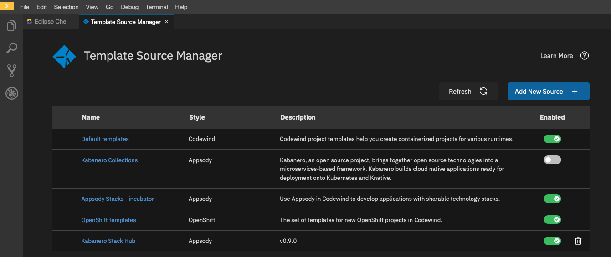

'''

=== step_00: Init with CodeReady Workspaces

Initial a new project in CodeReady Workspaces

.Step Overview
[%collapsible]
====
* Intro in Appsody
* Create the project using the `nodejs-express` stack from Kabanero Stack Hub
* Run the application
* Stop the app/container with `STRG+C` in the terminal
====

In CodeReady Workspaces

* Select `Codewind` pane
* ... click on the `+` or `No projects (Click here to create a project)` which will start the wizard
* ...scroll through the templates used from the Template Source Manager
* ...search for "Nodejs Express template", consider to use the template from the source `Kabanero Stack Hub`
* ...enter a name for the project and wait for creation
* during creation the output terminal displays the log output

The Dashboard will display the URL to the application after startup

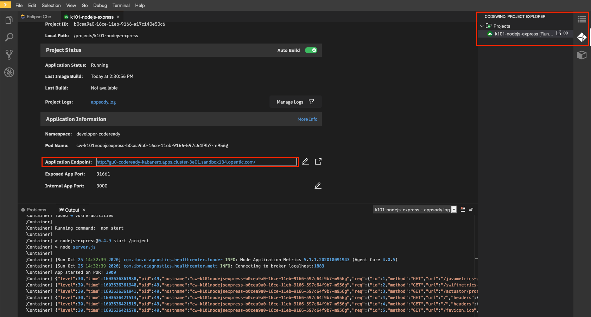

The application is running currently in the same namespace/project of the current CodeReady Workspaces (generally: `<userid>-codeready`)

[NOTE]
====
.Summary
* New project created using Appsody stack `nodejs-express` from the Kabanero Stack Hub in CodeReady Workspaces
* Application is runnable
* Application/Stack is cloud-native (ready)
* No points of contact with Docker, Kubernetes, OpenShift and any other resource definitions.
====

'''

=== step_00: Init locally

Initial the project locally.

.Step Overview
[%collapsible]
====
* Intro in Appsody
* Create the project using the `nodejs-express` stack from Kabanero Collection
* Run the application
* Call link:http://localhost:3000/[]
* Stop the app/container with `STRG+C` in the terminal
====

.Appsody overview
----

$ appsody repo list

NAME     	URL
*kabanero	https://github.com/kabanero-io/kabanero-stack-hub/releases/download/0.9.0/kabanero-stack-hub-index.yaml
appsodyex	https://github.com/appsody/stacks/releases/latest/download/experimental-index.yaml
incubator	https://github.com/appsody/stacks/releases/latest/download/incubator-index.yaml

$ appsody list

REPO     	ID                            	VERSION  	TEMPLATES               	DESCRIPTION
appsodyex	go-modules                    	0.1.0    	*default                	Runtime for Go using Go 1.11+ modules for dependencies
appsodyex	java-spring-boot2-liberty     	0.1.11   	*default                	Spring Boot on Open Liberty & OpenJ9 using Maven
appsodyex	nodejs-functions              	0.2.1    	*simple                 	Serverless runtime for Node.js functions
appsodyex	rocket                        	0.1.1    	*simple                 	Rocket web framework for Rust
appsodyex	rust                          	0.3.0    	*simple                 	Runtime for Rust applications
appsodyex	rust-tide                     	0.3.0    	*default                	Tide web framework for Rust
appsodyex	vertx                         	0.1.4    	*default                	Eclipse Vert.x runtime for running Java applications
incubator	java-microprofile [Deprecated]	0.2.27   	*default                	Eclipse MicroProfile on Open Liberty & OpenJ9 using Maven
incubator	java-openliberty              	0.2.17   	*default, kafka         	Eclipse MicroProfile & Jakarta EE on Open Liberty & OpenJ9 using Maven
incubator	java-spring-boot2             	0.3.30   	*default, kafka, kotlin 	Spring Boot using OpenJ9 and Maven
incubator	kitura                        	0.2.6    	*default                	Runtime for Kitura applications
incubator	node-red                      	0.1.3    	*simple                 	Node-RED runtime for running flows
incubator	nodejs                        	0.4.0    	*simple                 	Runtime for Node.js applications
incubator	nodejs-express                	0.4.13   	kafka, scaffold, *simple	Express web framework for Node.js
incubator	nodejs-loopback               	0.3.0    	*scaffold               	LoopBack 4 API Framework for Node.js
incubator	python-flask                  	0.2.4    	*simple                 	Flask web Framework for Python
incubator	quarkus                       	0.5.1    	*default, kafka         	Quarkus runtime for running Java applications
incubator	starter                       	0.1.3    	*simple                 	Runnable starter stack, copy to create a new stack
incubator	swift                         	0.3.0    	*simple                 	Appsody runtime for Swift applications
*kabanero	java-openliberty              	0.2.12   	*default, kafka         	Eclipse MicroProfile & Jakarta EE on Open Liberty & OpenJ9 using Maven
*kabanero	java-spring-boot2             	0.3.29   	*default, kafka, kotlin 	Spring Boot using OpenJ9 and Maven
*kabanero	nodejs                        	0.3.6    	*simple                 	Runtime for Node.js applications
*kabanero	nodejs-express                	0.4.8    	kafka, scaffold, *simple	Express web framework for Node.js
*kabanero	quarkus                       	0.3.6    	*default, kafka         	Quarkus runtime for running Java applications
----

Appsody Stacks, e.g. link:https://github.com/appsody/stacks/tree/master/incubator/nodejs-express[nodejs-express] compared to same stack option from Kabanero Collection: link:https://github.com/kabanero-io/collections/tree/master/incubator/nodejs-express[nodejs-express]. The main difference is the Pipeline support.

.Create project structure
----
$ mkdir k101-nodejs-express & cd k101-nodejs-express
$ appsody init kabanero/nodejs-express

$ tree -a

.
├── .appsody-config.yaml
├── .gitignore
├── .vscode
│   ├── launch.json
│   └── tasks.json
├── app.js
├── package-lock.json
├── package.json
└── test
    └── test.js

2 directories, 8 files
----

.Start the app
----
$ appsody run -v

...
[Container] App started on PORT 3000

$ docker ps | grep kabanero

$ appsody stop
----

.Test Endpoints
* Home: link:http://localhost:3000[]
* Health: link:http://localhost:3000/health[]
* Liveness: link:http://localhost:3000/live[]
* Readiness: link:http://localhost:3000/ready[]
* Prometheus Metrics: link:http://localhost:3000/metrics[]
* Dashboard: link:http://localhost:3000/appmetrics-dash[]

.Verification
* Check the content of the project and compare them with the link:https://github.com/kabanero-io/collections/tree/master/incubator/nodejs-express/templates/simple[template].
* See that a base docker image is now available `docker images | grep nodejs-express`
* Check the endpoints

[NOTE]
====
.Summary
* New project created using Appsody stack `nodejs-express` from the Kabanero Collections
* Application is runnable
* Application/Stack is cloud-native (ready)
* No points of contact with Docker, although it is used in the background.
====

'''

=== step_01: Code changes

Change the code and see immediately the modification online.

.Step Overview
[%collapsible]
====
* Start the app
* modify the `app.js` and add a new endpoint
* Call the new endpoint link:http://localhost:3000/echo/test-user[]
* Stop the app/container with `STRG+C` in the terminal
====

.Start the app
----
$ appsody run -v

...
[Container] App started on PORT 3000
----

.Add new endpoint with random delay in processing, file: app.js
[source,javascript]
----
const sleep = (waitTimeInMs) => new Promise(resolve => setTimeout(resolve, waitTimeInMs));

app.get('/echo/:val', (req, res) => {
  let val = req.params.val;

  let delay = Math.floor(1000 * (Math.random() * 5)); 
  sleep(delay).then(() => {
    res.send("Echo: " + val + "; delay=" + delay);
  })
  
});

// before
// module.exports.app = app;
----

Verify the terminal with the Appsody log output to see the monitored file change. Appsody restarts the node process with the latest change.

.Appsody log output
----
[Container] [ControllerDebug] File watch event detected for:  FILE "app.js" WRITE [/project/user-app/app.js]
...
[Container] [ControllerDebug] New process created with pid 57
[Container]
[Container] > nodejs-express@0.2.8 start /project
[Container] > node server.js

----

Verify also that the same docker container is still running

.Check docker process
----
$ docker ps | grep kabanero

ab14a8692277        kabanero/nodejs-express:0.2   "/.appsody/appsody-c…"   7 minutes ago       Up 7 minutes        0.0.0.0:3000->3000/tcp, 0.0.0.0:8080->8080/tcp, 0.0.0.0:9229->9229/tcp   k101-nodejs-express-dev
----

.Check the log from the docker process (similar to the log output from Appsody terminal)
----
$ docker logs -f $(docker ps | grep kabanero | awk '{print $1}')
----

.Verification
* Docker container is still the same, also after code changes. Check CREATED / STATUS from `docker ps`
* Execute the new endpoint link:http://localhost:3000/echo/Ich-Check-Das[]
* ...and see the the request(s) in the Dashboard

[NOTE]
====
.Summary
* Fast ramp-up. New nodejs-express created without taking care about project initialization, structure, dependencies
* Undisturbed development without (manual) server restarts
* Container support out of the box, without touching Dockerfile or Docker commands
====

'''

=== step_02: Codewind integration (Optional)

Integrate in Codewind and test and debug the flow including monitoring and performance.
This step is optional. 

.Prerequisites
[%collapsible]
====
* VSCode with Codewind plugin, use the marketplace and search for `ibm.codewind` (current version in 01.2020: 0.7.0)
** After installation, a `CODEWIND` view will be added to the VSCode window. Right click on `Local` and select `Start Local Codewind`. This will download the relevant Docker images.
====

.Codewind 0.7.0 workaround
----

docker tag eclipse/codewind-performance-amd64:0.7.0 codewind-performance-amd64:0.7.0
docker tag eclipse/codewind-pfe-amd64:0.7.0 codewind-pfe-amd64:0.7.0
----

.Steps
* Install Codewind plugin in VSCode - see prerequisites above.
* Add the existing project to Codewind. In Codewind view, select *Projects* > *Add Existing Project* and select the directory of the project
* Check Codewind features
** `Open App`: use the context menu in Codewind for the project, to open app in browser
** `Open Container Shell`: to get a shell into the container
** `Show all logs`: to get all logs from the container in the VSCode output view
** `Open Application Monitor`: to open in the browser the monitor page
** `Open Performance Dashboard`: to open the performance page and create a new test case
*** Press `Edit load run settings`
**** Path: `/echo/pf1`
**** Save
*** Run Load Test
**** set a name and execute the test. repeat this multiple times
** Observe the Application Monitor
* Restart the app in Debug Mode: Select in Codewind view `Restart in Debug Mode` (consider the status bar color of VSCode: orange for debug mode)
** Set a break point in `app.js`
** Open App: because after restarting is a new port exposed
** Make a request `/echo/debug`
** Go line by line in VSCode Debug perspective, observe and watch variables
** Restart in Run Mode

[NOTE]
====
.Summary
* Project provides out of the box multiple features like: Application Monitoring, Performance testing...all without explicitly configuration
* IDE integration in VSCode is helpful and hides any Appsody commands
* Debugging also out of the box supported
====

IMPORTANT: The features like Application Monitoring and Performance test support is dependent from the used Appsody stack. Currently not all stacks support this features.

'''

=== step_03: Manual Deployment

Deploy the application into a OCP Cluster (current OCPv4.2) using manual steps.

.Prerequisites
[%collapsible]
====
* OCPv4.2 cluster with Kabanero (provided from Admin/Instructor)
* `oc` cli installed on local machine
* Add the domain of the Container Registry to the docker daemon config to avoid insecure error messages
.${HOME}/.docker/daemon.json - Example with two Container Registry domains
[javascript]
----
{
    "bip":"172.18.0.1/24",
    "debug": true,
    "storage-driver": "overlay",
    "insecure-registries": [
        "registry.test.training.katacoda.com:4567", 
        "image-registry-openshift-image-registry.2886795280-80-shadow04.environments.katacoda.com"]
}
----
* Restart the docker daemon
====

.Step Overview
[%collapsible]
====
* Set the env vars for `CR_URL` and `PRJ_NAME`
* Connect to the OCP cluster
** Get the CLI command with token from the OCP Application console
** `oc login https://master.com:443 --token=....`
* Login to Container Registry
** If the Registry is insecure, you receive e.g. following error message `Error response from daemon: Get https://docker-registry-..example.com/v2/: x509: certificate signed by unknown authority`. 
** Add the domain in the Docker config for insecure registries.
** Login to OCP registry: `docker login -u $(oc whoami) -p $(oc whoami -t) http://${CR_URL}`
* Build a stable version 

* Tagging
** Tag and push the version: `appsody build -t ${PRJ_NAME}/k101-nodejs-express:v0.1 --push-url ${CR_URL}`
** Verify that an ImageStream is created
* Deployment
** Create the project in OCP: `oc new-project ${PRJ_NAME}`, if not available
** Deploy into the cluster using the internal image: `appsody deploy -t docker-registry.default.svc:5000/${PRJ_NAME}/k101-nodejs-express:v0.1 --namespace ${PRJ_NAME} --no-build`
* Verification
** Call the endpoint of the deployed app
** Call kAppNav to see the deployed app
====

TIP: Consider to change the application name in the different commands instead using of `k101-nodejs-express`.

.Prepare the current env context
----
$ export CR_URL=<the External OpenShift URL>
$ export CR_URL=$(oc get route -n openshift-image-registry image-registry --template='{{.spec.host}}')

$ export PRJ_NAME=<your-project-name>
----

.Build
----
$ docker login -u $(oc whoami) -p $(oc whoami -t) https://${CR_URL}
Login Succeeded

$ appsody build -t ${PRJ_NAME}/k101-nodejs-express:v0.1 --push-url ${CR_URL}
Extracting project from development environment
Pulling docker image docker.io/kabanero/nodejs-express:0.4
Running command: docker pull docker.io/kabanero/nodejs-express:0.4
0.4: Pulling from kabanero/nodejs-express
...
...
Built docker image k101-nodejs-express:v0.1
[Docker] Successfully tagged image-registry-openshift-image-registry.apps.cluster-d0b4.sandbox1891.opentlc.com/demo00/k101-nodejs-express:v0.1
Pushing image image-registry-openshift-image-registry.apps.cluster-d0b4.sandbox1891.opentlc.com/demo00/k101-nodejs-express:v0.1
Built docker image image-registry-openshift-image-registry.apps.cluster-d0b4.sandbox1891.opentlc.com/demo00/k101-nodejs-express:v0.1
Running command: docker create --name test3-extract docker.io/kabanero/nodejs-express:0.4
Running command: docker cp test3-extract:/config/app-deploy.yaml /Users/haddouti/codewind-workspace/test3/app-deploy.yaml
Running command: docker rm test3-extract -f
Created deployment manifest: /Users/haddouti/codewind-workspace/test3/app-deploy.yaml
----

.Check the Manifest file containing info about image, k8s probes etc
----
$ cat app-deploy.yaml

...
spec:
  applicationImage: docker-registry-default.apps.bcaf.example.opentlc.com/demo-express/k101-nodejs-express:v0.1
  createKnativeService: false
  expose: true
  livenessProbe:
    failureThreshold: 12
    httpGet:
      path: /live
      port: 3000
    initialDelaySeconds: 5
    periodSeconds: 2
...
----

.The Build with push results also in an ImageStream in OCP Cluster
----

$ oc get is -n ${PRJ_NAME}
NAME                  IMAGE REPOSITORY                                                              TAGS   UPDATED
k101-nodejs-express   image-registry.openshift-image-registry.svc:5000/demo00/k101-nodejs-express   v0.1   3 minutes ago
----

With Appsody is also possible to deploy the application into an OpenShift Cluster.
The deploy command also (re-)build the application. New Appsody versions (> 0.5) provides the flag `--no-build` to skip the build sub-step.

.Deploy
----
$ oc new-project ${PRJ_NAME}

Now using project "demo-express" on server "https://master.com:443".

$ appsody deploy -t ${CR_URL}/${PRJ_NAME}/k101-nodejs-express:v0.1 --namespace ${PRJ_NAME} --no-build

Extracting project from development environment
Pulling docker image kabanero/nodejs-express:0.2
Running command: docker pull kabanero/nodejs-express:0.2
0.2: Pulling from kabanero/nodejs-express
Digest: sha256:ae05d5a746aa0f043ce589fa73fe8139dc5d829787a8433f9fa01ccd83b9fadb
Status: Image is up to date for kabanero/nodejs-express:0.2
docker.io/kabanero/nodejs-express:0.2
[Warning] The stack image does not contain APPSODY_PROJECT_DIR. Using /project
...

Running command: kubectl get route k101-nodejs-express -o jsonpath={.status.ingress[0].host} --namespace demo-express
Deployed project running at k101-nodejs-express-demo-express.apps.bcaf.example.opentlc.com
----

.Get the automatically generated route
----
$ oc get route -n ${PRJ_NAME}
NAME                  HOST/PORT                                                        PATH   SERVICES              PORT       TERMINATION   WILDCARD
k101-nodejs-express   k101-nodejs-express-demo-express.apps.bcaf.example.opentlc.com          k101-nodejs-express   3000-tcp                 None

$ curl "http://$(oc get route k101-nodejs-express -n ${PRJ_NAME} -o jsonpath='{.spec.host}')/echo/mega"

Echo: mega; delay=2681
----

.Deployment verification
----
$ curl "http://$(oc get route k101-nodejs-express -n demo-express -o jsonpath='{.spec.host}')/echo/mega"

Echo: mega; delay=2681

$ echo "https://$(oc get routes kappnav-ui-service -n kappnav -o jsonpath='{.spec.host}')/kappnav-ui"
https://kappnav-ui-service-kappnav.apps.bcaf.example.opentlc.com/kappnav-ui/

$ oc get application -n ${PRJ_NAME}
NAME                  AGE
k101-nodejs-express   51m

$ oc get application -n ${PRJ_NAME} k101-nodejs-express -o yaml

$ oc describe application -n ${PRJ_NAME} k101-nodejs-express

$ oc get pods -n ${PRJ_NAME}
NAME                                  READY   STATUS    RESTARTS   AGE
k101-nodejs-express-ffbf86dc4-gvhnn   1/1     Running   0          16m
----

.Delete application
----
$ appsody deploy delete -n ${PRJ_NAME}

Deleting deployment using deployment manifest app-deploy.yaml
Attempting to delete resource from Kubernetes...
Running command: kubectl delete -f app-deploy.yaml --namespace demo40
Deployment deleted
----

[NOTE]
====
.Summary
* For deployment we enter the Appsody world (again), will be optimized in near future
* Deployment handled from an `AppsodyApplication` operator and creates all resources, incl. routes
* `Application` resource also is installed holding all meta information to the application
* Again no Docker contact points, except the tag name.
====

'''

=== step_04: Manual Deployment with Pipeline

Deploy manually an application into a OCP Cluster (current OCPv4.x) using Tekton Pipelines.

Kabanero (Foundation) provides a set of predefined pipelines for the different stacks.
For our project is the pipeline `nodejs-express-build-deploy-pipeline` relevant, which builds and deploy the project from an existing Git repo. 

Kabanero deploys in the same namespace where Kabanero CR is deployed, usually `kabanero`. To support other target namespaces is the Kabanero CR enhanced, also the manifest file `app-deploy.yaml` contains the target namespace.

For simplicity the following is given:

* Public repository with Kabanero application (this one here)
* Target Namespace is `demo-express`
* No GitHub Secret is needed
* Kabanero is configured to support multiple target namespaces

.Prerequisites
[%collapsible]
====
* OCP Cluster
* Kabanero Foundation installed, incl. Tekton
* Public Git repo with Kabanero application
====

TIP: Consider to replace the Git Repo URL in the Pipeline definition if you will use your own repository. Otherwise imagine you have already pushed your new application and code change to the given Git repo and you will deploy the latest version with Kabanero Pipeline.

[NOTE]
====
.Overview
* Test Pipeline Execution: manual trigger
** Create the PipelineResources for git repo and docker image
** Create a PipelineRun using the Pipeline `nodejs-express-build-deploy-pipeline` with the new created resources
** Watch the pipeline and task runs: `oc get pipelinerun --all-namespaces --watch` and `oc get taskrun --all-namespaces --watch`
** A script exists with all necessary steps: `manual-tekton-pipelinerun.sh`
** Verify the pipeline execution and resulting app
====

.Verify the existing Pipelines
----
$ oc get pipeline --all-namespaces
NAMESPACE   NAME                                      AGE
kabanero    java-microprofile-build-deploy-pipeline   1d
kabanero    java-spring-boot2-build-deploy-pipeline   1d
kabanero    nodejs-build-deploy-pipeline              1d
kabanero    nodejs-express-build-deploy-pipeline      1d
kabanero    nodejs-loopback-build-deploy-pipeline     1d
...
kabanero    pipeline0                                 1d
----

.Check the details of the nodejs-express pipeline
----
$ oc get pipeline nodejs-express-build-push-deploy-pipeline -n kabanero -o yaml

apiVersion: tekton.dev/v1alpha1
kind: Pipeline
metadata:
  annotations:
    manifestival: new
...
  name: nodejs-express-build-push-deploy-pipeline
  namespace: kabanero
...
spec:
  resources:
  - name: git-source
    type: git
  - name: docker-image
    type: image
  tasks:
  - name: build-task
    resources:
      inputs:
      - name: git-source
        resource: git-source
      outputs:
      - name: docker-image
        resource: docker-image
    taskRef:
      name: nodejs-express-build-task
  - name: deploy-task
    resources:
      inputs:
      - name: git-source
        resource: git-source
      - name: docker-image
        resource: docker-image
    runAfter:
    - build-task
    taskRef:
      name: nodejs-express-deploy-task
----

.Verify the existing Pipeline Tasks
----
$ oc get task --all-namespaces
NAMESPACE   NAME                            AGE
kabanero    java-microprofile-build-task    1d
kabanero    java-microprofile-deploy-task   1d
kabanero    java-spring-boot2-build-task    1d
kabanero    java-spring-boot2-deploy-task   1d
kabanero    monitor-result-task             1d
kabanero    nodejs-build-task               1d
kabanero    nodejs-deploy-task              1d
kabanero    nodejs-express-build-task       1d
kabanero    nodejs-express-deploy-task      1d
kabanero    nodejs-loopback-build-task      1d
kabanero    nodejs-loopback-deploy-task     1d
...
kabanero    pipeline0-task                  1d
----

.Check details of the nodejs-express relevant tasks
----
$ oc get task nodejs-express-build-task -n kabanero -o yaml
...

$ oc get task nodejs-express-deploy-task -n kabanero -o yaml
...
----

You can also use the Tekton Dashboard to verify the Pipeline and Task definitions

* Tekton Dashboard
** Select `Pipelines`, the Info-Button provides the definition
** Select `Tasks`, Info-Button

To execute a Pipeline create two PipelineResource objects, one holding the Git Repo and the other the resulting Docker Image URL.
To avoid any conflicts with other participants contains both resource the project name as prefix.

.Manual pipeline trigger (see also: ./manual-tekton-pipelinerun.sh)
----

$ cat pipelinerun_add.sh
#!/bin/sh
namespace=kabanero
APP_REPO=https://github.com/haf-tech/k101-nodejs-express.git
REPO_BRANCH=master
DOCKER_IMAGE="image-registry.openshift-image-registry.svc:5000/${PRJ_NAME}/k101-nodejs-express:v0.1"

cat <<EOF | oc -n ${namespace} apply -f -
apiVersion: v1
items:
- apiVersion: tekton.dev/v1alpha1
  kind: PipelineResource
  metadata:
    name: ${PRJ_NAME}-docker-image
  spec:
    params:
    - name: url
      value: ${DOCKER_IMAGE}
    type: image
- apiVersion: tekton.dev/v1alpha1
  kind: PipelineResource
  metadata:
    name: ${PRJ_NAME}-git-source
  spec:
    params:
    - name: revision
      value: ${REPO_BRANCH}
    - name: url
      value: ${APP_REPO}
    type: git
kind: List
EOF

$ oc get pipelineresource -n kabanero
NAME           AGE
docker-image   14s
git-source     14s

$ cat pipelinerun_exec.sh

#!/bin/sh

namespace=kabanero
APP_REPO=https://github.com/haf-tech/k101-nodejs-express.git
REPO_BRANCH=master
DOCKER_IMAGE="image-registry.openshift-image-registry.svc:5000/${PRJ_NAME}/k101-nodejs-express:v0.1"

cat <<EOF | oc -n ${namespace} apply -f -
apiVersion: tekton.dev/v1alpha1
kind: PipelineRun
metadata:
  name: ${PRJ_NAME}-nodejs-express-build-push-deploy-pipeline-run-1
  namespace: kabanero
spec:
  pipelineRef:
    name: nodejs-express-build-push-deploy-pipeline
  resources:
  - name: git-source
    resourceRef:
      name: ${PRJ_NAME}-git-source
  - name: docker-image
    resourceRef:
      name: ${PRJ_NAME}-docker-image
  serviceAccount: kabanero-operator
  timeout: 60m
EOF

----

Verify the log of the PipelineRun, find the Pod in `-n kabanero` representing the current PipelineRun and display the logs for one of the sub steps. Each step is own container.

.Commands to retrieve the right pod and display logs from one internal container (representing a step)
----
$ oc project kabanero

$ oc get pipelinerun 
NAME                                              SUCCEEDED   REASON    STARTTIME   COMPLETIONTIME
nodejs-express-build-push-deploy-pipeline-run-3   Unknown     Running   7m58s

$ oc logs -f $(oc get pods | grep $(oc get pipelinerun --no-headers | awk {'print $1'} | grep -v 'Completed') | awk {'print $1'})

Error from server (BadRequest): a container name must be specified for pod nodejs-express-build-push-deploy-pipeline-run-3-build-pus-5fxt5-pod-13ec4b, choose one of: [step-create-dir-docker-image-vgw6f step-git-source-demo00-git-source-vzv7z step-extract step-validate-collection-is-active step-build step-push step-deploy-image step-image-digest-exporter-trdb4] or one of the init containers: [step-credential-initializer-kcp97 create-dir-default-image-output-dgldc step-place-tools]

$ oc logs -f $(oc get pods | grep $(oc get pipelinerun --no-headers | awk {'print $1'}) | awk {'print $1'}) -c step-build
...

----

You can also verify the current PipelineRun in Tekton Dashboard

* Open *Tekton* Dashboard
* Select `PipelineRuns` and select the running item

The application is also available as `Application` resource in the Cluster. Details are available within kAppNav:

* Open the *kAppNav* Dashboard
* Check the applications
* Select the application and verify the corresponding Kubernetes resources like Service, Deployment etc.
* Find the route of the application:
** Select the application
** Click on the `Route` item in the Component listing
** You will be forwarded to the OpenShift detailed view
** Click on the route URL
** add `/echo/ping` to the URL

[NOTE]
====
.Summary
* Deployment into Kubernetes/OCP Cluster works, from Source code 
* Deployment approach independent from the used technology stack of the app
* Do not care which tools or how a build or deployment works
====

'''

=== step_05: Automatic Deployment with Pipeline

Deploy the application into a OCP Cluster (current OCPv4.2) using GitHub Webhook.

Wit the help of a GitHub Webhook new PipelineRuns are executed.
The Webhook configuration in Tekton contains the information which Pipeline and Docker Image to be used.

For simplicity the following is given:

* Public repository with Kabanero application (this one here)
* Target Namespace is `demo-express`
* No GitHub Secret is needed
* Kabanero is configured to support multiple target namespaces
* A default Webhook is also configured. Skip the Webhook configuration instruction if you want to re-use it

.Prerequisites
[%collapsible]
====
* OCP Cluster
* Kabanero Foundation installed, incl. Tekton
* Public Git repo with Kabanero application
====

TIP: Consider to replace the Git Repo URL in the Pipeline definition if you will use your own repository. Otherwise imagine you have already pushed your new application and code change to the given Git repo and you will deploy the latest version with Kabanero Pipeline.

[NOTE]
====
.Overview
* Test Pipeline Execution: triggered by Webhook
** Create a GitHub PAT
** Create in Tekton a Webhook, this will register the Webhook in the GitHub repo
** Push a change and watch the pipeline execution
====

.Overview
* Create GitHub Personal Access Token
** Enter GitHub > Profile *Settings* > *Developer Settings* > *Personal Access Tokens*. *Generate new token*
*** Set name
*** Set permission: `admin:repo_hook`
*** Remember the token!
* Configure Tekton Webhook for GitHub
** Call Tekton Dashboard `echo "http://$(oc get routes tekton-dashboard -n kabanero -o jsonpath='{.spec.host}')"`
** Select *Webhooks*
** Set fields:
*** Name: demo-express-webhook
*** Repository URL: The URL to the Git repo, e.g. https://github.com/haf-tech/k101-nodejs-express.git
*** Access Token: Press + and define a name and the Github PAT
*** Namespace: kabanero
*** Pipeline: select the pipeline, here `nodejs-express-build-deploy-pipeline`
*** Service Account: kabanero-operator
*** Docker Registry: e.g. the internal one with the namespace, `image-registry.openshift-image-registry.svc:5000/demo-express`
*** Create.
*** This will trigger a WebHook creation in GitHub.
** Verify the WebHook in GitHub
*** Select repo in GitHub
*** Select Settings > Webhook and the new created Webhook item
*** Scroll to the bottom and check the result of the last Webhook Execution
*** If error, redeliver and see if status code is `200`. The first initialization can take approx 5min.
* Create the project/namespace if not done `demo-express`, before pushing the first image to the project.
* Test Webhook Integration: automatic trigger
** Watch all PipelineRuns `oc get pipelinerun --all-namespaces --watch`
** Make a small change and push it in the Git repo
*** Check always the Tekton dashboard under PipelineRun first, if the Webhook received or not, even if Github says there was an error like Timeout.

[NOTE]
====
.Summary
* Triggering a deployment from Source control is also supported
* End-2-End process from Git commit until deployment into a cluster is covered
====

'''

=== step_06: Git Workflow - Test pull request

This section is part of the link:https://www.ibm.com/support/knowledgecenter/SSCSJL_4.2.x/guides/integrating-events-operator/integrating-events-operator.html#test-the-webhook[webhook proccessing flow] with the main steps

1. A pull request from the branch initialise a build and reports back the result
2. A merge to master initialise a build and enabled also a deploy. Enabling deployment with `body.webhooks-tekton-local-deploy` in `EventMediator`
3. A tag on master initialise a new tag for the image that was previously built. 

This section handles step 1. with the pull request.

.Prerequisites
[%collapsible]
====
* OCP Cluster
* Kabanero installed
* Webhook and event pipeline applied and configured
====

[NOTE]
====
.Overview
* Test Pipeline Execution: triggered by Webhook
** Create a new branch
** Make some changes
** Create a pull request
** This will trigger a pipeline run
====

* Create new branch `git checkout -b test_pullrequest_01`
* make some changes in `app.js`
* commit and push changes into the new branch
* listen to logs in the webhook `oc logs -f -n kabanero -l app=webhook`
* create a pull request from this branch
* wait for the pipeline run
* wait aferwards for the test report in the pull request

.Verify the logs from the webhook
----
$ oc logs -n kabanero -l app=webhook

I1107 16:46:47.671455       1 webhook_util.go:245] Payload validated with signature b629aa813472fbe066a22e3a4ff10da9face09ab
I1107 16:46:47.671503       1 event.go:41] Received request. Header: map[Accept:[*/*] Connection:[close] Content-Length:[11327] Content-Type:[application/json] User-Agent:[GitHub-Hookshot/8ca99f5] X-Github-Delivery:[d338deb2-2118-11eb-8a84-bf639ee86507] X-Github-Event:[status] X-Github-Hook-Id:[259688319] X-Github-Hook-Installation-Target-Id:[73435999] X-Github-Hook-Installation-Target-Type:[organization] X-Hub-Signature:[sha1=b629aa813472fbe066a22e3a4ff10da9face09ab] X-Hub-Signature-256:[sha256=0c34c8fe399072e5c0eefd77da8c3096330fa97f6eb725457ebbd03051c65f87]]
I1107 16:46:47.671600       1 event.go:53] Listener received body: {"id":11286255464, .... GitHub Webhook Payload}
I1107 16:46:47.672029       1 queue.go:43] Enqueue called
I1107 16:46:47.672279       1 event.go:81] Worker thread processing url: /, header: map[Accept:[*/*] Connection:[close] Content-Length:[11327] Content-Type:[application/json] User-Agent:[GitHub-Hookshot/8ca99f5] X-Github-Delivery:[d338deb2-2118-11eb-8a84-bf639ee86507] X-Github-Event:[status] X-Github-Hook-Id:[259688319] X-Github-Hook-Installation-Target-Id:[73435999] X-Github-Hook-Installation-Target-Type:[organization] X-Hub-Signature:[sha1=b629aa813472fbe066a22e3a4ff10da9face09ab] X-Hub-Signature-256:[sha256=0c34c8fe399072e5c0eefd77da8c3096330fa97f6eb725457ebbd03051c65f87]], 
I1107 16:46:47.673023       1 managers.go:203] GetMediator: look up key: events.kabanero.io/v1alpha1/EventMediator/kabanero/webhook
I1107 16:46:47.673037       1 managers.go:210] GetMediator: mediator found 
I1107 16:46:47.673045       1 eventmediator_controller.go:574]
...
I1107 16:46:47.910033       1 eventcel.go:980] For stack docker.io/kabanero/nodejs-express:0.4, found event listener http://el-listener-caf603b6.kabanero.svc.cluster.local:8080, version: 0.4.8
...
I1107 16:46:47.931240       1 eventcel.go:2217] in sendEventCEL
I1107 16:46:47.931262       1 eventcel.go:2246] sendEventCEL first param type: string, second param type: map
I1107 16:46:47.931606       1 eventmediator_controller.go:842] generateSendEventHandler calling LookupDestinationEdpoints, mediation webhook, destination: dest
I1107 16:46:47.931635       1 connections.go:48] LookupDestinationEndpoints for name: webhook, mediation: webhook, destination: dest
I1107 16:46:47.931648       1 connections.go:57] eventEndpointMatch: actual : name: webhook, mediation: webhook, destination: dest, connections: name: webhook, mediations: webhook, destination: dest, equals: true
I1107 16:46:47.931661       1 connections.go:82] LookupDestinationEndpoints returned 1 connections
I1107 16:46:47.931670       1 eventmediator_controller.go:844] generateSendEventHandler returned from LookupDestinationEdpoints, mediation webhook, destination: dest
I1107 16:46:47.931682       1 eventmediator_controller.go:868] UrlExpression: body["webhooks-kabanero-tekton-listener"]
I1107 16:46:47.933796       1 eventmediator_controller.go:883] generateSendEventHandler: sending message to http://el-listener-caf603b6.kabanero.svc.cluster.local:8080
I1107 16:46:47.974047       1 status.go:87] AddEventSummary: {0001-01-01 00:00:00 +0000 UTC send-event [{mediation webhook} {repository https://github.com/ocp-universe/kabanero-nodejs-express} {github-event status} {stack docker.io/kabanero/nodejs-express:0.4} {urlExpression body["webhooks-kabanero-tekton-listener"]}] failed Send event to http://el-listener-caf603b6.kabanero.svc.cluster.local:8080 failed. Error: Send to http://el-listener-caf603b6.kabanero.svc.cluster.local:8080 failed with http status 202 Accepted}
E1107 16:46:47.974125       1 eventmediator_controller.go:893] generateSendEventHandler: error sending message: Send to http://el-listener-caf603b6.kabanero.svc.cluster.local:8080 failed with http status 202 Accepted
I1107 16:46:47.974143       1 eventcel.go:2287] sendEvent successfully sent message to destination 'dest'
----

.Verify logs in event listener
----
$ oc logs el-listener-caf603b6-79989b6476-2m797 -n kabanero

{"level":"info","logger":"eventlistener","caller":"sink/sink.go:167","msg":"params: %+v[{gitsecretname {string personal-github-secret []}} {gitsecretkeyname {string password []}} {commentsuccess {string Success []}} {dashboardurl {string http://tekton-dashboard-tekton-pipelines.apps.cluster-6f68.sandbox389.opentlc.com []}} {pullrequesturl {string https://github.com/ocp-universe/kabanero-nodejs-express/pull/5 []}} {statusesurl {string https://api.github.com/repos/ocp-universe/kabanero-nodejs-express/statuses/3626b6d1aa5c5c28d97ad3b328b4a964fc0d0e67 []}} {commentfailure {string Failed []}} {commenttimeout {string Unknown []}} {commentmissing {string Missing []}} {provider {string github []}} {apiurl {string  []}} {insecure-skip-tls-verify {string true []}} {webhooks-tekton-service-account {string kabanero-pipeline []}}]","knative.dev/controller":"eventlistener","/triggers-eventid":"k6qlv","/trigger":"kabanero-monitor-task-event"}
{"level":"info","logger":"eventlistener","caller":"sink/sink.go:167","msg":"params: %+v[{event-ref {string other []}} {gitrepositoryurl {string https://github.com/ocp-universe/kabanero-nodejs-express.git []}} {docker-imagename {string kabanero-nodejs-express []}} {webhooks-tekton-git-org {string ocp-universe []}} {webhooks-tekton-git-repo {string kabanero-nodejs-express []}} {webhooks-tekton-git-branch {string test_pullrequest_01 []}} {webhooks-tekton-docker-registry {string image-registry.openshift-image-registry.svc:5000/demo-kabanero []}} {gitrevision {string 3626b6d1aa5c5c28d97ad3b328b4a964fc0d0e67 []}} {docker-imagetag {string 3626b6d1aa5c5c28d97ad3b328b4a964fc0d0e67 []}} {event-type {string pull_request []}} {webhooks-tekton-git-server {string github.com []}} {webhooks-tekton-target-namespace {string kabanero []}} {webhooks-tekton-service-account {string kabanero-pipeline []}}]","knative.dev/controller":"eventlistener","/triggers-eventid":"k6qlv","/trigger":"kabanero-pullrequest-event"}
{"level":"info","logger":"eventlistener","caller":"resources/create.go:93","msg":"Generating resource: kind: &APIResource{Name:pipelineresources,Namespaced:true,Kind:PipelineResource,Verbs:[delete deletecollection get list patch create update watch],ShortNames:[],SingularName:pipelineresource,Categories:[tekton tekton-pipelines],Group:tekton.dev,Version:v1alpha1,StorageVersionHash:krJrgz9JMyY=,}, name: pull-request-shphr","knative.dev/controller":"eventlistener"}
{"level":"info","logger":"eventlistener","caller":"resources/create.go:101","msg":"For event ID \"k6qlv\" creating resource tekton.dev/v1alpha1, Resource=pipelineresources","knative.dev/controller":"eventlistener"}
{"level":"info","logger":"eventlistener","caller":"resources/create.go:93","msg":"Generating resource: kind: &APIResource{Name:pipelineresources,Namespaced:true,Kind:PipelineResource,Verbs:[delete deletecollection get list patch create update watch],ShortNames:[],SingularName:pipelineresource,Categories:[tekton tekton-pipelines],Group:tekton.dev,Version:v1alpha1,StorageVersionHash:krJrgz9JMyY=,}, name: git-source-tc7cp","knative.dev/controller":"eventlistener"}
{"level":"info","logger":"eventlistener","caller":"resources/create.go:101","msg":"For event ID \"k6qlv\" creating resource tekton.dev/v1alpha1, Resource=pipelineresources","knative.dev/controller":"eventlistener"}
{"level":"info","logger":"eventlistener","caller":"resources/create.go:93","msg":"Generating resource: kind: &APIResource{Name:pipelineresources,Namespaced:true,Kind:PipelineResource,Verbs:[delete deletecollection get list patch create update watch],ShortNames:[],SingularName:pipelineresource,Categories:[tekton tekton-pipelines],Group:tekton.dev,Version:v1alpha1,StorageVersionHash:krJrgz9JMyY=,}, name: docker-image-tc7cp","knative.dev/controller":"eventlistener"}
{"level":"info","logger":"eventlistener","caller":"resources/create.go:101","msg":"For event ID \"k6qlv\" creating resource tekton.dev/v1alpha1, Resource=pipelineresources","knative.dev/controller":"eventlistener"}
{"level":"info","logger":"eventlistener","caller":"resources/create.go:93","msg":"Generating resource: kind: &APIResource{Name:taskruns,Namespaced:true,Kind:TaskRun,Verbs:[delete deletecollection get list patch create update watch],ShortNames:[tr trs],SingularName:taskrun,Categories:[tekton tekton-pipelines],Group:tekton.dev,Version:v1beta1,StorageVersionHash:uaFcE9Pr3Ok=,}, name: monitor-task-caf603b6-taskrun-","knative.dev/controller":"eventlistener"}
{"level":"info","logger":"eventlistener","caller":"resources/create.go:101","msg":"For event ID \"k6qlv\" creating resource tekton.dev/v1beta1, Resource=taskruns","knative.dev/controller":"eventlistener"}
{"level":"info","logger":"eventlistener","caller":"resources/create.go:93","msg":"Generating resource: kind: &APIResource{Name:pipelineruns,Namespaced:true,Kind:PipelineRun,Verbs:[delete deletecollection get list patch create update watch],ShortNames:[pr prs],SingularName:pipelinerun,Categories:[tekton tekton-pipelines],Group:tekton.dev,Version:v1beta1,StorageVersionHash:4xDTCrDXyFg=,}, name: build-pl-caf603b6-run-","knative.dev/controller":"eventlistener"}
{"level":"info","logger":"eventlistener","caller":"resources/create.go:101","msg":"For event ID \"k6qlv\" creating resource tekton.dev/v1beta1, Resource=pipelineruns","knative.dev/controller":"eventlistener"}
----

.Logs in the monitor-task pod
----
$ oc logs -n kananero monitor-task-caf603b6-taskrun-dxv9b-pod-7tqdb -c ...

{"level":"info","ts":1604767869.1772377,"caller":"pullrequest/api.go:254","msg":"

Creating comment ## Tekton Status Report

Status | Pipeline | PipelineRun | Namespace
:----- | :------- | :--------------- | :--------
[**Success**](http://tekton-dashboard-tekton-pipelines.apps.cluster-6f68.sandbox389.opentlc.com/#/namespaces/kabanero/pipelineruns/build-pl-caf603b6-run-29fzh) | build-pl-caf603b6 | build-pl-caf603b6-run-29fzh | kabanero for PR 5",

"resource_type":"pullrequest","mode":"upload","provider":"github","owner":"ocp-universe","repo":"kabanero-nodejs-express","pr":"5"}

----

.Pipeline details
----
$ oc logs -n kabanero -l tekton.dev/pipelineTask=build-task -l webhooks.tekton.dev/gitRepo=kabanero-nodejs-express
...
----

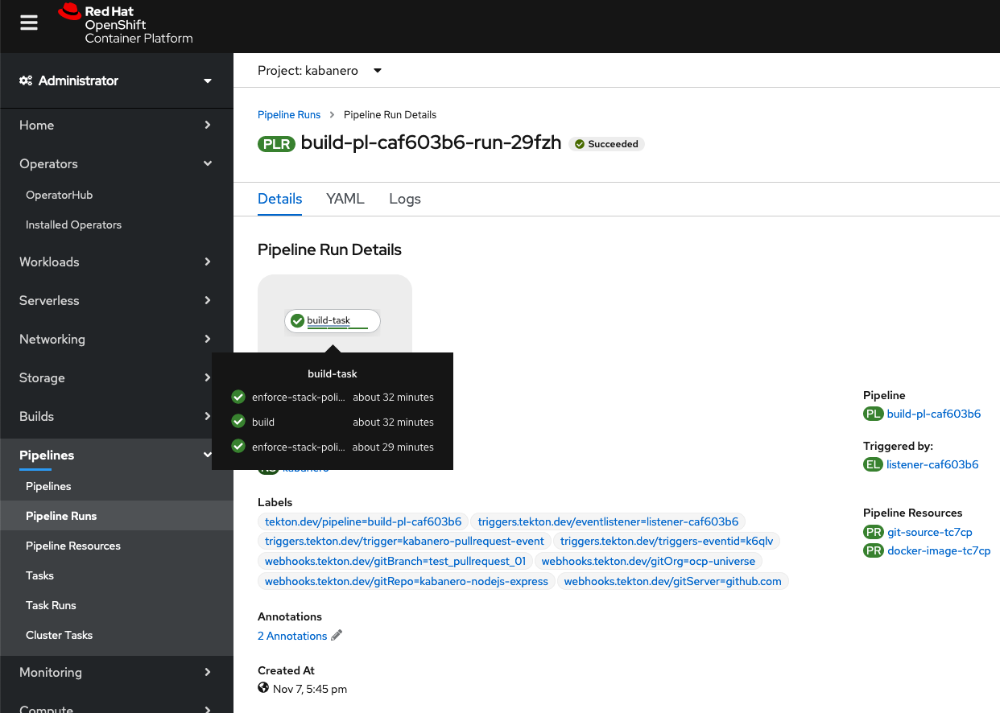

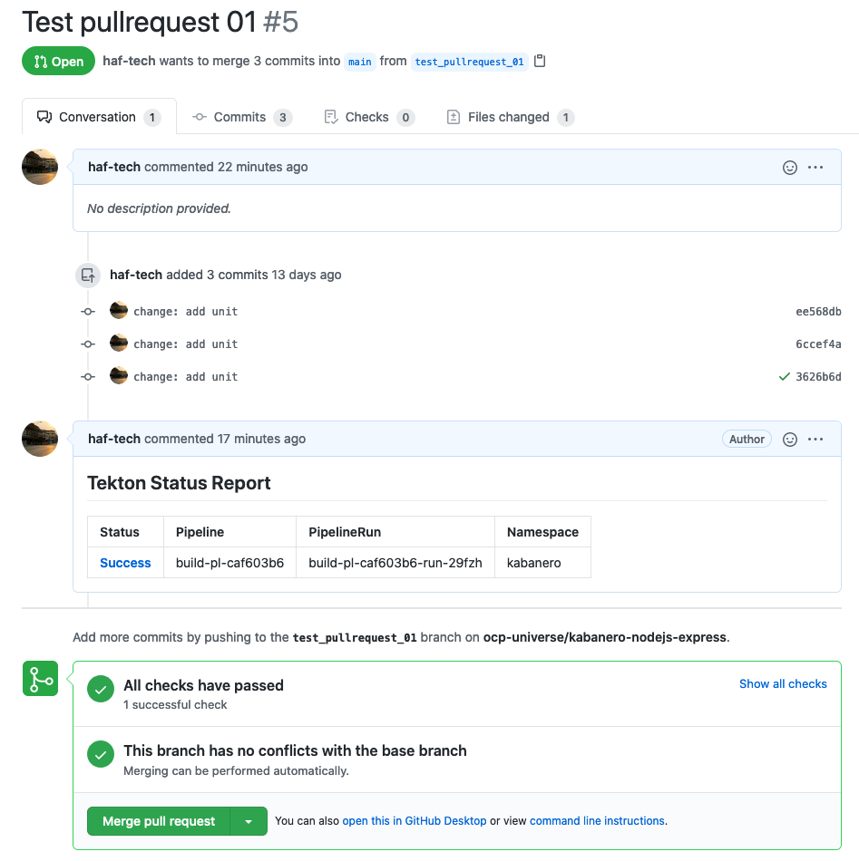

[NOTE]
====
.Summary
* Automtatically verifies pull requests if they are valid (build successful) or not
* Simplifies the entire CI/CD pipeline and increase the quality
====

'''

=== step_06: Git Workflow - Test merge

This section is part of the link:https://www.ibm.com/support/knowledgecenter/SSCSJL_4.2.x/guides/integrating-events-operator/integrating-events-operator.html#test-the-webhook[webhook proccessing flow] with the main steps

1. A pull request from the branch initialise a build and reports back the result
2. A merge to master initialise a build and enabled also a deploy. Enabling deployment with `body.webhooks-tekton-local-deploy` in `EventMediator`
3. A tag on master initialise a new tag for the image that was previously built. 

This section handles step 2. with accepting the pull request and merge into master.

.Prerequisites
[%collapsible]
====
* OCP Cluster
* Kabanero installed
* Webhook and event pipeline applied and configured
* Pull request from the previous step
====

[NOTE]
====
.Overview
* Test Pipeline Execution: triggered by Webhook
** Accept and merge the pull request
====

* Merge the successful tested pull request in GitHub
** Select pull request
** press the button `Merge pull request`
** press `Confirm merge` and adjust the comment if wanted
* see the logs in `webhook` and `eventlistener` pods
* check the new executed pipeline run `build-push-promote-pl-...`

.Verify the logs from the webhook
----
$ oc logs -n kabanero -l app=webhook

I1107 18:16:11.542788       1 webhook_util.go:245] Payload validated with signature 3c70b4114d47b8051fc61de3d0e20192352bd2ef
I1107 18:16:11.542819       1 event.go:41] Received request. Header: map[Accept:[*/*] Connection:[close] Content-Length:[25435] Content-Type:[application/json] User-Agent:[GitHub-Hookshot/8ca99f5] X-Github-Delivery:[4fb99100-2125-11eb-8be3-581d56ec7884] X-Github-Event:[pull_request] X-Github-Hook-Id:[259688319] X-Github-Hook-Installation-Target-Id:[73435999] X-Github-Hook-Installation-Target-Type:[organization] X-Hub-Signature:[sha1=3c70b4114d47b8051fc61de3d0e20192352bd2ef] X-Hub-Signature-256:[sha256=9b35c040fefe19b689f14ad98a4a68c3f0bb8543ffc2cdc3aa18fc2937c5b4c1]]
I1107 18:16:11.542891       1 event.go:53] Listener received body: {"action":"closed","number":6,"pull_request":{"url":"..."}}

...

I1107 18:16:11.645064       1 event.go:41] Received request. Header: map[Accept:[*/*] Connection:[close] Content-Length:[9410] Content-Type:[application/json] User-Agent:[GitHub-Hookshot/8ca99f5] X-Github-Delivery:[5057499a-2125-11eb-9c91-4f9bf1a0d17a] X-Github-Event:[push] X-Github-Hook-Id:[259688319] X-Github-Hook-Installation-Target-Id:[73435999] X-Github-Hook-Installation-Target-Type:[organization] X-Hub-Signature:[sha1=c25885cbeaf6f8676e90813d399df99261859245] X-Hub-Signature-256:[sha256=907cbacce1eb9ef9418a629888d9138d40c3e8d4f75d8347f6051302671743fa]]
I1107 18:16:11.645103       1 event.go:53] Listener received body: {"ref":"refs/heads/main", ... }

...
I1107 18:16:11.848831       1 eventmediator_controller.go:883] generateSendEventHandler: sending message to http://el-listener-caf603b6.kabanero.svc.cluster.local:8080
I1107 18:16:11.892340       1 status.go:87] AddEventSummary: {0001-01-01 00:00:00 +0000 UTC send-event [{mediation webhook} {repository https://github.com/ocp-universe/kabanero-nodejs-express} {github-event pull_request} {stack docker.io/kabanero/nodejs-express:0.4} {urlExpression body["webhooks-kabanero-tekton-listener"]}] failed Send event to http://el-listener-caf603b6.kabanero.svc.cluster.local:8080 failed. Error: Send to http://el-listener-caf603b6.kabanero.svc.cluster.local:8080 failed with http status 202 Accepted}

----

.Verify logs in event listener
----
$ oc logs el-listener-caf603b6-79989b6476-2m797 -n kabanero

{"level":"info","logger":"eventlistener","caller":"sink/sink.go:167","msg":"params: %+v[{webhooks-tekton-target-namespace {string kabanero []}} {gitrepositoryurl {string https://github.com/ocp-universe/kabanero-nodejs-express.git []}} {docker-imagename {string kabanero-nodejs-express []}} {docker-imagetag {string 10b64084d54bc96f1df4c6a9ea85971c51f53253 []}} {webhooks-tekton-git-org {string ocp-universe []}} {gitrevision {string 10b64084d54bc96f1df4c6a9ea85971c51f53253 []}} {webhooks-tekton-git-repo {string kabanero-nodejs-express []}} {webhooks-tekton-git-branch {string main []}} {event-ref {string refs/heads/main []}} {webhooks-tekton-local-deploy {string true []}} {git-project {string kabanero-nodejs-express []}} {webhooks-tekton-git-server {string github.com []}} {event-type {string push []}} {webhooks-tekton-service-account {string kabanero-pipeline []}} {webhooks-tekton-docker-registry {string image-registry.openshift-image-registry.svc:5000/demo-kabanero []}}]","knative.dev/controller":"eventlistener","/triggers-eventid":"z7xkv","/trigger":"kabanero-push-event"}
{"level":"info","logger":"eventlistener","caller":"resources/create.go:93","msg":"Generating resource: kind: &APIResource{Name:pipelineresources,Namespaced:true,Kind:PipelineResource,Verbs:[delete deletecollection get list patch create update watch],ShortNames:[],SingularName:pipelineresource,Categories:[tekton tekton-pipelines],Group:tekton.dev,Version:v1alpha1,StorageVersionHash:krJrgz9JMyY=,}, name: git-source-t4kpj","knative.dev/controller":"eventlistener"}
{"level":"info","logger":"eventlistener","caller":"resources/create.go:101","msg":"For event ID \"z7xkv\" creating resource tekton.dev/v1alpha1, Resource=pipelineresources","knative.dev/controller":"eventlistener"}
{"level":"info","logger":"eventlistener","caller":"resources/create.go:93","msg":"Generating resource: kind: &APIResource{Name:pipelineresources,Namespaced:true,Kind:PipelineResource,Verbs:[delete deletecollection get list patch create update watch],ShortNames:[],SingularName:pipelineresource,Categories:[tekton tekton-pipelines],Group:tekton.dev,Version:v1alpha1,StorageVersionHash:krJrgz9JMyY=,}, name: docker-image-t4kpj","knative.dev/controller":"eventlistener"}
{"level":"info","logger":"eventlistener","caller":"resources/create.go:101","msg":"For event ID \"z7xkv\" creating resource tekton.dev/v1alpha1, Resource=pipelineresources","knative.dev/controller":"eventlistener"}
{"level":"info","logger":"eventlistener","caller":"resources/create.go:93","msg":"Generating resource: kind: &APIResource{Name:pipelineruns,Namespaced:true,Kind:PipelineRun,Verbs:[delete deletecollection get list patch create update watch],ShortNames:[pr prs],SingularName:pipelinerun,Categories:[tekton tekton-pipelines],Group:tekton.dev,Version:v1beta1,StorageVersionHash:4xDTCrDXyFg=,}, name: build-push-promote-pl-caf603b6-run-","knative.dev/controller":"eventlistener"}
{"level":"info","logger":"eventlistener","caller":"resources/create.go:101","msg":"For event ID \"z7xkv\" creating resource tekton.dev/v1beta1, Resource=pipelineruns","knative.dev/controller":"eventlistener"}

----

.Pipeline details
----
$ oc logs -n kabanero -l tekton.dev/pipelineTask=build-task -l webhooks.tekton.dev/gitRepo=kabanero-nodejs-express
...
----

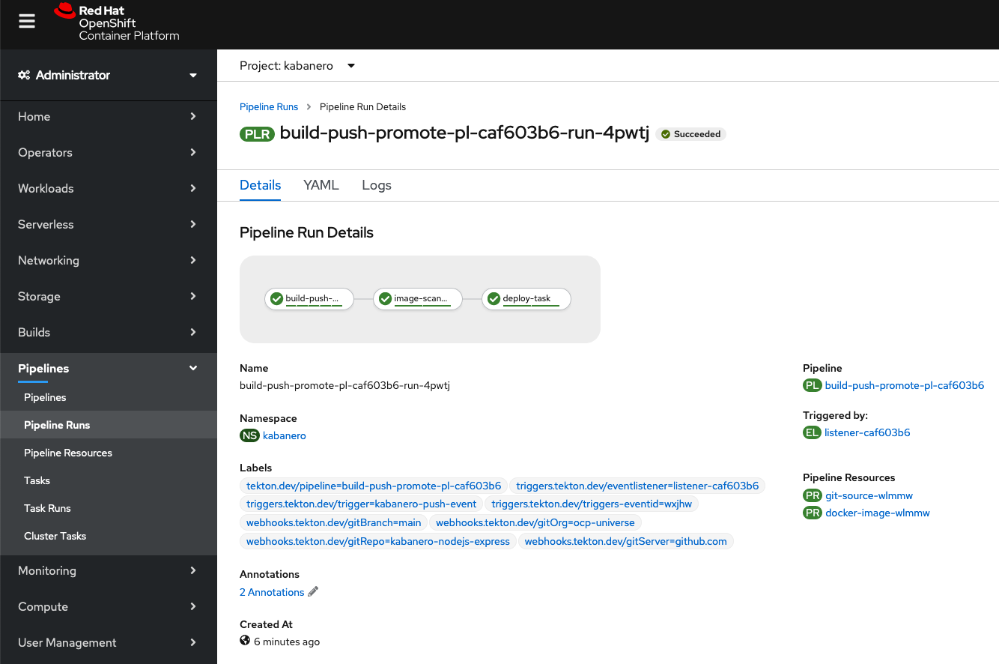

.Check that the app is deployed and running
----
$ oc get pods -n demo-kabanero
NAME                                   READY   STATUS    RESTARTS   AGE
k101-nodejs-express-668ff987f9-7pq7r   1/1     Running   0          3m34s

oc get is -n demo-kabanero
NAME                      IMAGE REPOSITORY                                                                         TAGS                                                   UPDATED
kabanero-nodejs-express   image-registry.openshift-image-registry.svc:5000/demo-kabanero/kabanero-nodejs-express   768595105e40a775d95a11b9f35bd7664f5939a1 + 3 more...   4 minutes ago

$ oc get route -n demo-kabanero
NAME                  HOST/PORT                                                                    PATH   SERVICES              PORT       TERMINATION   WILDCARD
k101-nodejs-express   k101-nodejs-express-demo-kabanero.apps.cluster-6f68.sandbox389.opentlc.com          k101-nodejs-express   3000-tcp                 None
----

[NOTE]
====
.Summary
* Automtatical deployment if the build was successful
* Simplifies the entire CI/CD pipeline
====

'''

=== step_06: Git Workflow - Tag release

This section is part of the link:https://www.ibm.com/support/knowledgecenter/SSCSJL_4.2.x/guides/integrating-events-operator/integrating-events-operator.html#test-the-webhook[webhook proccessing flow] with the main steps

1. A pull request from the branch initialise a build and reports back the result
2. A merge to master initialise a build and enabled also a deploy. Enabling deployment with `body.webhooks-tekton-local-deploy` in `EventMediator`
3. A tag on master initialise a new tag for the image that was previously built. 

This section handles step 3. with creating a tag/release from master.

.Prerequisites
[%collapsible]
====
* OCP Cluster
* Kabanero installed
* Webhook and event pipeline applied and configured
* A version in master
====

[NOTE]
====
.Overview
* Test Pipeline Execution: triggered by Webhook
** Create a tag in GitHub
====

* Merge the successful tested pull request in GitHub
** Create a tag in GitHub, e.g. `v0.1`
** this will trigger an event which creates an image tag

.Pipeline details
----
$ oc logs -n kabanero -l triggers.tekton.dev/trigger=kabanero-tag-event -l webhooks.tekton.dev/gitRepo=kabanero-nodejs-express
...
----

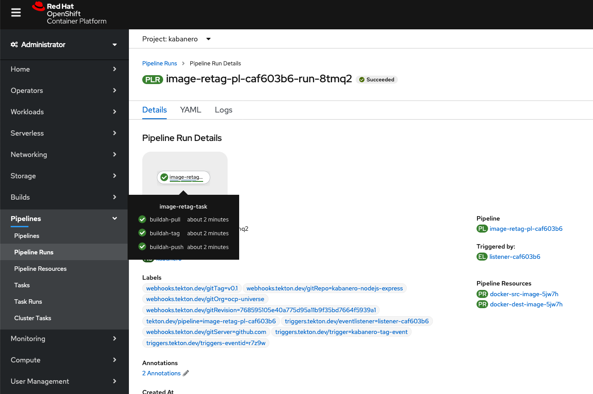

.Check image stream
----
oc get is -n demo-kabanero 
NAME                      IMAGE REPOSITORY                                                                         TAGS                                                        UPDATED
kabanero-nodejs-express   image-registry.openshift-image-registry.svc:5000/demo-kabanero/kabanero-nodejs-express   v0.1,768595105e40a775d95a11b9f35bd7664f5939a1 + 3 more...   4 minutes ago
----

The image is automatically tagged.

[NOTE]
====
.Summary
* Creation of releases with image tags is also automatically supported
====

'''

== Kabanero Changes

This chapters summarize the changes from Kabanero 0.4.0 to 0.9

* Kabanero bases now on Operators
** Kabanero
** Appsody
** Open Liberty
** Serverless
** Pipeline
** ServiceMesh
** CodeReady Workspace
** Elasticsearch, Kiali, Jaeger, 
* Support Organization Webhooks instead only repo related Webhooks
* Governance
** Version compliance check
* Event support

.Deprecation
* Tekton Dashboard: Pipeline view is integrated in OpenShift Webconsole
* Webhooks Extension: An optimized solution based on event operator and only one webhook instead of one webhook per repository
* Appsody CLI and pipelines: replacement through oko

== Kabanero Resource Impact

This chapter gives a short overview of the additional resource (CPU and Memory) consumption.
The following figures illustrate the overall consumption of CPU and memory for the entire cluster before and after installation of Kabanero

.Fresh cluster, CPU consumption
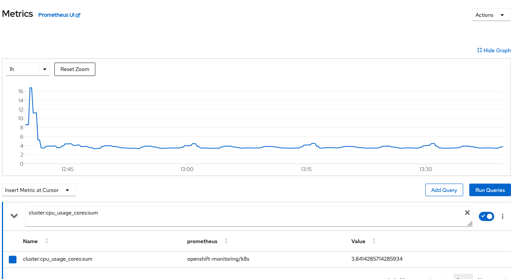

.After Kabanero installation, CPU consumption
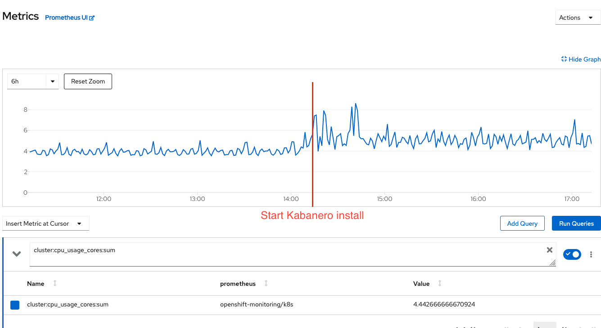

.Fresh cluster, Memory consumption
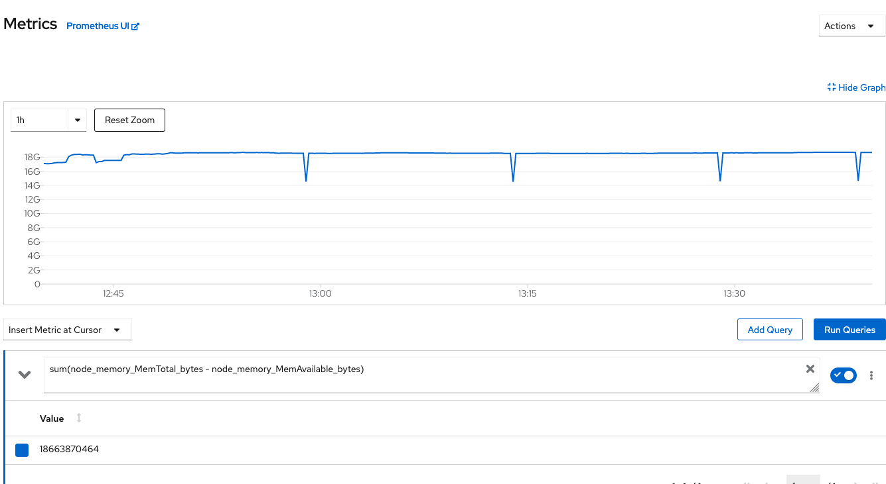

.After Kabanero installation, Memory consumption
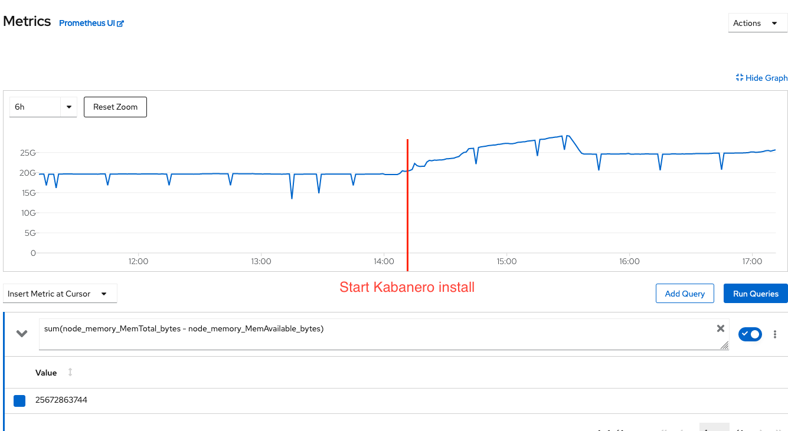

And the next figures for the additional resources for specific namespaces (holding the different related Kabanero resources/components)

[%collapsible]
====
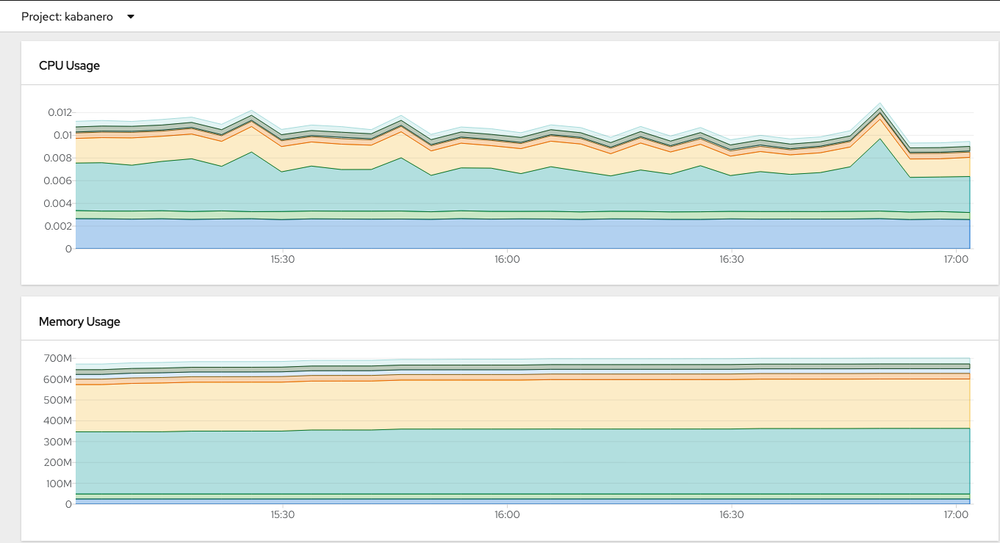
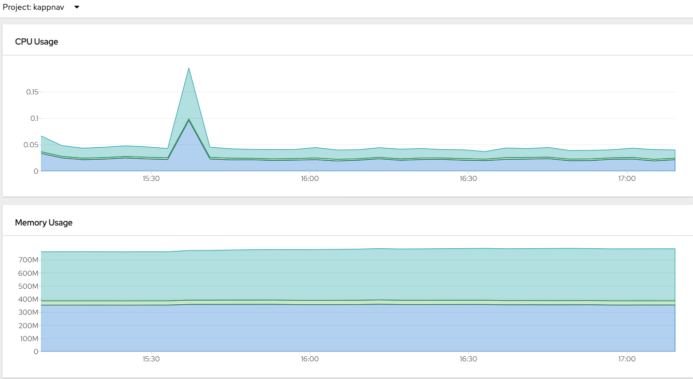
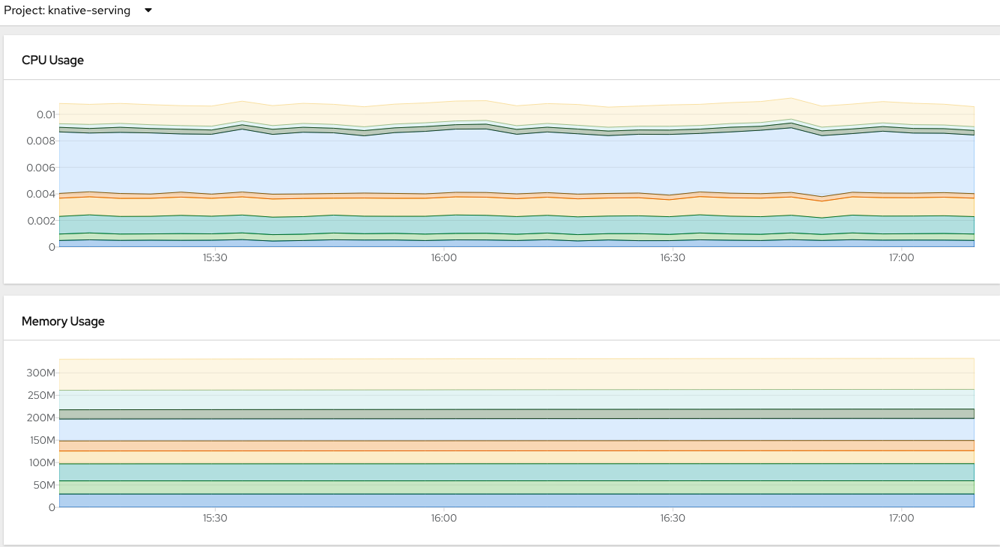
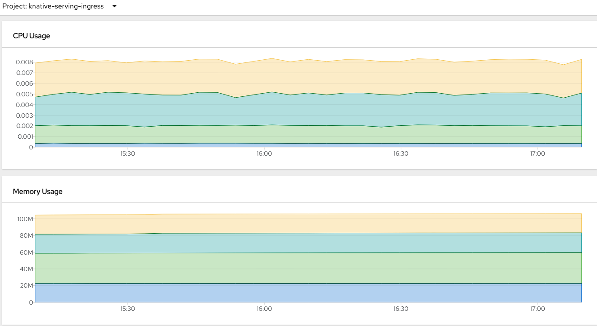
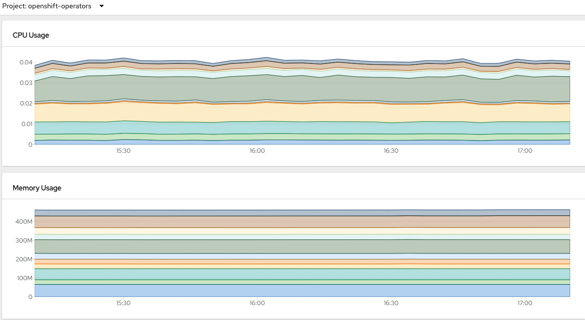
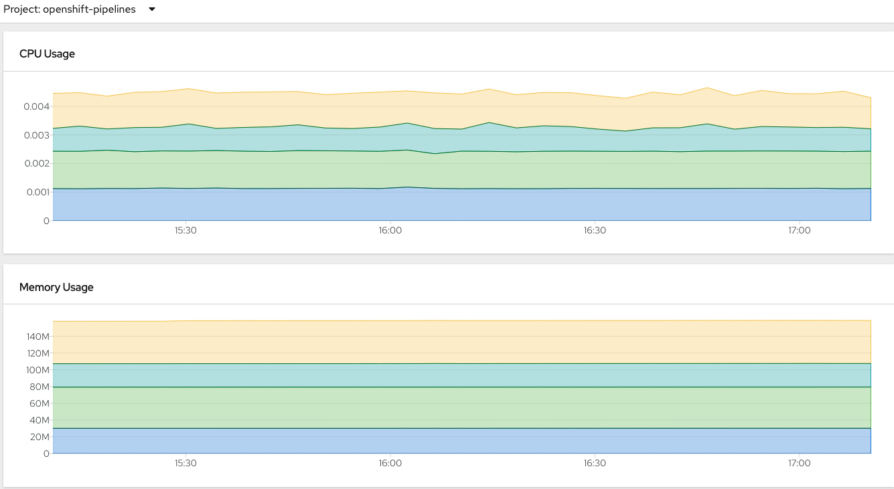
====

== Troubleshooting

=== Codewind - SSH Key permission denied

The import a git private repo does not work, cause the ssh key is not accessible, link:https://github.com/eclipse/che/issues/18252[]

.Error message
----
> git clone git@github.com:ocp-universe/kabanero-nodejs-express.git /projects/kabanero-nodejs-express
Cloning into '/projects/kabanero-nodejs-express'...
Warning: Permanently added the RSA host key for IP address '140.82.121.4' to the list of known hosts.
Load key "/etc/ssh/private/default-1604249560727": Permission denied
Load key "/etc/ssh/private/github.com": Permission denied
git@github.com: Permission denied (publickey).
fatal: Could not read from remote repository.

----

*Solution*: Unknown

*Workaround*: Delete the ssh keys and re-create them. However this works only during the current session, cause the keys will be not persisted.

=== Codewind - Git master branch

The import of an existing project into CodeReady Workspaces with Codewind fails, link:https://github.com/eclipse/codewind/issues/3236[].

.Error message
----
Error importing project: Error running cwctl project bind: invalid character 'P' looking for beginning of value: time="2020-11-01T17:31:16Z" level=error msg="invalid character 'P' looking for beginning of value" 
----

*Solution*: Unknown

=== Kabanero - Deployment not possible due permission issue for service account

Deploy pipeline run can not deploy application because the service account `kabanero-pipeline` can not access `AppsodyApplication`.
Details are in the pipeline run deployment `deploy-task`, link:https://github.com/kabanero-io/kabanero-operator/issues/702[].

.Error message
----
step-deploy-image
Error from server (Forbidden): error when retrieving current configuration of:
Resource: "appsody.dev/v1beta1, Resource=appsodyapplications", GroupVersionKind: "appsody.dev/v1beta1, Kind=AppsodyApplication"
Name: "kabanero-nodejs-express", Namespace: "kabanero"
from server for: "/workspace/git-source/app-deploy.yaml": appsodyapplications.appsody.dev "kabanero-nodejs-express" is forbidden: User "system:serviceaccount:kabanero:kabanero-pipeline" cannot get resource "appsodyapplications" in API group "appsody.dev" in the namespace "kabanero"
----

----
$ oc get rolebinding -A | grep kaban
demo-kabanero                                      kabanero-pipeline-deploy-rolebinding                              ClusterRole/kabanero-pipeline-deploy-role                              91m

----

*Solution*:

* It is important that the rolebinding is in the namespace where the application will be deployed
* Also important that the `app-deploy.yaml` contains the right target namespace, otherwise default `kabanero` will be used

=== Kabanero - Pipeline not executed for merge into master branch

A merge into master does not trigger a pipeline run. Master branch is however named not master but e.g. `main`.

*Solution*:

In this case, replace the condition in the `EventListener`

[source,yaml]
----
  - bindings: 
    - apiversion: v1alpha1
      kind: TriggerBinding
      name: build-push-promote-pl-caf603b6-push-binding
    interceptors:
    - cel:
        filter: body["webhooks-tekton-event-type"] == "push" && (body["webhooks-tekton-git-branch"]
          == "master" || body["webhooks-tekton-git-branch"] == "main")
    name: kabanero-push-event
    template:
      apiversion: v1alpha1
      name: build-push-promote-pl-caf603b6-template
----

=== Kabanero installation - Kappnav not matches

During installation of Kabanero 0.9

.Error message
----
namespace/kappnav created
customresourcedefinition.apiextensions.k8s.io/kappnavs.kappnav.operator.kappnav.io created
serviceaccount/kappnav-operator created
clusterrole.rbac.authorization.k8s.io/kappnav-operator created
clusterrolebinding.rbac.authorization.k8s.io/kappnav-operator created
deployment.apps/kappnav-operator created
error: unable to recognize "https://raw.githubusercontent.com/kabanero-io/kabanero-operator/0.9.2/deploy/optional.yaml": no matches for kind "Kappnav" in version "kappnav.operator.kappnav.io/v1"
----

However the resource/kind is available

----
$ oc api-resources | grep -i kappnav
kindactionmappings                    kam,kams           actions.kappnav.io                    true         KindActionMapping
kappnavs                                                 kappnav.operator.kappnav.io           true         Kappnav
----

.Solution
* Re-apply the installation script

=== Appsody - insufficient space

.Error message
----
[Container] npm ERR! nospc ENOSPC: no space left on device, mkdir '/opt/app-root/src/.npm/_cacache/content-v2/sha512/93/fb'
[Container] npm ERR! nospc There appears to be insufficient space on your system to finish.
[Container] npm ERR! nospc Clear up some disk space and try again.
----

.Solution
----
$ npm cache clear --force
$ docker system prune
----
and restart the app

=== Kabanero - Mediation not found

.Error message
----
$ oc get EventMediator -o yaml
....
status:
  summary:
  - input:
    - name: mediation
      value: webhook
    - name: file
      value: .appsody-config.yaml
    message: 'Unable to download file. Error: unable to get repository owner, name,
      or html_url from webhook message: unable to find repository in webhook message'
    operation: find-mediation
    result: failed
----

.Solution
* Mostly the GitHub PAT has not enough permissions
* Relevant permission `repo`

=== Kabanero - PipelineRun is not triggered after git commit/pull_request

.Error message
----
$ oc logs -f -n kabanero -l app=webhook

E1025 19:47:08.004192       1 kabanero_util.go:334] Unable to find listener from stack for appsody repo docker.io/kabanero/nodejs-express:0.4
I1025 19:47:08.004212       1 eventcel.go:980] For stack docker.io/kabanero/nodejs-express:0.4, found event listener http://UNKNOWN_KABAKERO_TEKTON_LISTENER, version: 0.0.0
...
controller.go:883] generateSendEventHandler: sending message to http://UNKNOWN_KABAKERO_TEKTON_LISTENER
I1025 19:47:08.038253       1 status.go:87] AddEventSummary: {0001-01-01 00:00:00 +0000 UTC send-event [{mediation webhook} {repository https://github.com/ocp-universe/kabanero-nodejs-express} {github-event pull_request} {stack docker.io/kabanero/nodejs-express:0.4} {urlExpression body["webhooks-kabanero-tekton-listener"]}] failed Send event to http://UNKNOWN_KABAKERO_TEKTON_LISTENER failed. Error: Post http://UNKNOWN_KABAKERO_TEKTON_LISTENER: dial tcp: lookup UNKNOWN_KABAKERO_TEKTON_LISTENER on 172.30.0.10:53: no such host}
E1025 19:47:08.038287       1 eventmediator_controller.go:893] generateSendEventHandler: error sending message: Post http://UNKNOWN_KABAKERO_TEKTON_LISTENER: dial tcp: lookup UNKNOWN_KABAKERO_TEKTON_LISTENER on 172.30.0.10:53: no such host
I1025 19:47:08.038298       1 eventcel.go:2287] sendEvent successfully sent message to destination 'dest'
I1025 19:47:08.038304       1 eventcel.go:1066] When setting variable  to sendEvent(dest, body, header), eval of value results in typename: string, value type: string, value: 
I1025 19:47:08.038310       1 status.go:87] AddEventSummary: {0001-01-01 00:00:00 +0000 UTC evaluate-mediation [{mediation webhook} {repository https://github.com/ocp-universe/kabanero-nodejs-express} {github-event pull_request} {stack docker.io/kabanero/nodejs-express:0.4}] completed }
I1025 19:47:08.038325       1 eventcel.go:490] Leaving Processor.ProcessMessage for mediation webhook
I1025 19:47:08.038342       1 status.go:241] Updater SendUpdate called
I1025 19:47:08.038352       1 event.go:87] Worker thread completed processing url: /
I1025 19:47:08.038368       1 queue.go:53] Dequeue called
I1025 19:47:08.038379       1 status.go:219] Updater getStatus: Received status
I1025 19:47:10.038594       1 status.go:227] Updater getStatus: Timer fired, has status: true

$ oc get EventMediator -o yaml

- name: urlExpression
      value: body["webhooks-kabanero-tekton-listener"]
    message: 'Send event to http://UNKNOWN_KABAKERO_TEKTON_LISTENER failed. Error:
      Post http://UNKNOWN_KABAKERO_TEKTON_LISTENER: dial tcp: lookup UNKNOWN_KABAKERO_TEKTON_LISTENER
      on 172.30.0.10:53: no such host'

$ oc get stack
NAME                AGE   SUMMARY
java-openliberty    16h   
java-spring-boot2   3d    [ 0.3.29: active ]
nodejs              3d    [ 0.3.6: active ]
nodejs-express      16h   
quarkus             3d    [ 0.3.6: active ]
----

`.appsody-config.yaml`: the value from the field `stack` will be used to find the stack with the same image
The stack should be `active` and have an event listener associated. Also the `EventListener` exists.

*Solution*:
Delete the stack and the Kabanero operator will recreate them `oc delete stack nodejs-express -n kabanero`. After a while see that the stack is then active

----
$ oc get stack
NAME                AGE   SUMMARY
java-openliberty    16h   
java-spring-boot2   3d    [ 0.3.29: active ]
nodejs              3d    [ 0.3.6: active ]
nodejs-express      16h   [ 0.4.8: active ]
quarkus             3d    [ 0.3.6: active ]
----

=== Appsody - deploy expect nodeName

.Error message
----
$ appsody deploy -t ... --no-build
...
Running command: kubectl get pod -l "app.kubernetes.io/name=kabanero-nodejs-express" -o "jsonpath={.items[].spec.nodeName}" --namespace demo-kabanero
[Error] Failed to get deployment hostname and port: Failed to find nodeName for deployed service: kubectl get failed: exit status 1: error: error executing jsonpath "{.items[].spec.nodeName}": array index out of bounds: index 0, length 0
[Error] Failed to find deployed service IP and Port: Failed to find nodeName for deployed service: kubectl get failed: exit status 1: error: error executing jsonpath "{.items[].spec.nodeName}": array index out of bounds: index 0, length 0
----

Application will be deployed also a route will be applied.

=== Kabanero - 

.Error message
----
# verify the received webhooks
$ oc logs -f -l app=webhook
....

$ oc logs -f el-listener-... -n kabanero

{"level":"error","logger":"eventlistener","caller":"sink/sink.go:210","msg":"expression body[\"webhooks-tekton-event-type\"] == \"pull_request\" && body[\"webhooks-tekton-git-branch\"] != \"master\" && (body[\"action\"] == \"opened\" || body[\"action\"] == \"synchronize\" )  did not return true","knative.dev/controller":"eventlistener","/triggers-eventid":"kxvgh","/trigger":"kabanero-monitor-task-event","stacktrace":"github.com/tektoncd/triggers/pkg/sink.Sink.executeInterceptors\n\t/go/src/github.com/tektoncd/triggers/pkg/sink/sink.go:210\ngithub.com/tektoncd/triggers/pkg/sink.Sink.processTrigger\n\t/go/src/github.com/tektoncd/triggers/pkg/sink/sink.go:147\ngithub.com/tektoncd/triggers/pkg/sink.Sink.HandleEvent.func1\n\t/go/src/github.com/tektoncd/triggers/pkg/sink/sink.go:97"}
{"level":"error","logger":"eventlistener","caller":"sink/sink.go:149","msg":"expression body[\"webhooks-tekton-event-type\"] == \"pull_request\" && body[\"webhooks-tekton-git-branch\"] != \"master\" && (body[\"action\"] == \"opened\" || body[\"action\"] == \"synchronize\" )  did not return true","knative.dev/controller":"eventlistener","/triggers-eventid":"kxvgh","/trigger":"kabanero-monitor-task-event","stacktrace":"github.com/tektoncd/triggers/pkg/sink.Sink.processTrigger\n\t/go/src/github.com/tektoncd/triggers/pkg/sink/sink.go:149\ngithub.com/tektoncd/triggers/pkg/sink.Sink.HandleEvent.func1\n\t/go/src/github.com/tektoncd/triggers/pkg/sink/sink.go:97"}
----

.Normal PipelineRun for nodejs-express, Build
----
step-create-dir-docker-image-486tw

step-git-source-git-source-gnr4l-zlvtx
{"level":"info","ts":1603799754.7264361,"caller":"git/git.go:105","msg":"Successfully cloned https://github.com/ocp-universe/kabanero-nodejs-express.git @ 3626b6d1aa5c5c28d97ad3b328b4a964fc0d0e67 in path /workspace/git-source"}
{"level":"warn","ts":1603799754.7265031,"caller":"git/git.go:152","msg":"Unexpected error: creating symlink: symlink /tekton/home/.ssh /root/.ssh: file exists"}
{"level":"info","ts":1603799754.774239,"caller":"git/git.go:133","msg":"Successfully initialized and updated submodules in path /workspace/git-source"}

step-enforce-stack-policy-pre-build
[INFO] Running the script /scripts/image_registry_access_setup.sh ....
[INFO] The image registries that got added successfully to insecure list are = [ 'image-registry.openshift-image-registry.svc:5000' ]
[INFO] Enforcing 'stackPolicy' of 'activeDigest'.
[INFO] Read project, stack image, docker host and stack name from .appsody-config.yaml
[INFO] Git project config in .appsody-config.yaml...
[INFO] VERSION = 0.4
[INFO] STACK_IMAGE_REGISTRY = docker.io
[INFO] PROJECT = kabanero
[INFO] STACK_NAME = nodejs-express
[INFO] IMAGE_REGISTRY_HOST used finally = docker.io
[INFO] Successfully read project, stack image, docker host and stack name from .appsody-config.yaml
[INFO] Validate stack name & project are present, active in the Kabanero CR
[INFO] In the cluster...
[INFO] STACK_IMAGE = docker.io/kabanero/nodejs-express
[INFO] STACK_IMAGE_REGISTRY = docker.io
[INFO] PROJECT = kabanero
[INFO] STACK_NAME = nodejs-express
[INFO] Sucessfully validated stack name & project are present, active in the Kabanero CR
[INFO] VERSIONS = 0.4.8
[INFO] DIGESTS = ffc1d561fb7f029f9d29eeb6e86e2909894c830f607234260b50c33ba4b21ba5
[INFO] Cluster stack digest: ffc1d561fb7f029f9d29eeb6e86e2909894c830f607234260b50c33ba4b21ba5
[INFO] Project stack version: 0.4, Project stack digest: "sha256:3c1d5d2c2ef19d71a4677fb37fa9dbaf0b2a4051734beab7c95ed7a0dfde1f01"
[WARNING] .appsody-config.yaml, stack: value patched from 'docker.io/kabanero/nodejs-express:0.4' to 'docker.io/kabanero/nodejs-express:0.4.8' according to stackPolicy setting of 'activeDigest'
[INFO] The application stack, kabanero/nodejs-express:0.4, in .appsody-config.yaml is active on this cluster and passes stackPolcy validation.

step-build
[INFO] Running the script /scripts/image_registry_access_setup.sh ....
[INFO] The image registries that got added successfully to insecure list are = [ 'image-registry.openshift-image-registry.svc:5000' ]
[INFO] Completed setup for image registry access.
[INFO] Stack registry URL = docker.io
[INFO] Application image URL = image-registry.openshift-image-registry.svc:5000/demo-kabanero/kabanero-nodejs-express:3626b6d1aa5c5c28d97ad3b328b4a964fc0d0e67
[INFO] Running appsody build...
[Warning]
*
*
*
A new CLI update is available.
Please go to https://appsody.dev/docs/getting-started/installation#upgrading-appsody and upgrade from 0.6.1 --> 0.6.4.
*
*
*
Successfully added your project to /tekton/home/.appsody/project.yaml
Your Appsody project ID has been set to 20201027115603.16326366
Extracting project from development environment
Pulling docker image docker.io/kabanero/nodejs-express:0.4.8
Running command: buildah pull docker.io/kabanero/nodejs-express:0.4.8
Getting image source signatures
Copying blob sha256:c4d668e229cd131e0a8e4f8218dca628d9cf9697572875e355fe4b247b6aa9f0
Copying blob sha256:5e2ae0c76e83847010202c40d0c7ebac953a6c7871efdea7602b41507b3d11f5
Copying blob sha256:ec1681b6a383e4ecedbeddd5abc596f3de835aed6db39a735f62395c8edbff30
Copying blob sha256:35ad9b4fba1fa6b00a6f266303348dc0cf9a7c341616e800c2738030c0f64167
Copying blob sha256:da1cc572023a942fff15d59aefa5abbb59d2c24a03966db8074ef8f9bab277d4
Copying blob sha256:ea3710bec333895a4922b72f57916186648920ec92dafac1a289fc3324d3b9c0
Copying blob sha256:7b3823f7ebde9300d57854d978226e4efbc4b5571b878c6c4e7c435ed61a4181
Copying blob sha256:c47b5fd6f7a3b4c02320fd496f598c54e26e1c03134df3fb00fae1df809e68ce
Copying blob sha256:9b5933f69d6d33cc69b91d65c373d8ba2b3c7d573070116c383d1db3b1280172
Copying blob sha256:fbe252e5486bb0aef92082a8cc0bf6c95c79706a41974bb78d7b29220defa789
Copying blob sha256:5ac12b6967e7ea9409dc816372640574ee237e808f667a5b6ea2ba1cd23dba1d
Copying blob sha256:ca7ed1c83a566b4020246dade2267d15308853943e0c990bc250513d1972a99d
Copying blob sha256:534812799fe954611a29dec4970bdbbedc07fa18cd1e2f354ad885db0b68c5c0
Copying config sha256:a0c18317466fad1929235cac789c85bd3ff7b2d7d422933dc1eb0c47a118a5f9
Writing manifest to image destination
Storing signatures
a0c18317466fad1929235cac789c85bd3ff7b2d7d422933dc1eb0c47a118a5f9
Running command: buildah from --name kabanero-nodejs-express-extract -v /workspace/git-source/:/project/user-app docker.io/kabanero/nodejs-express:0.4.8
Project extracted to /tekton/home/.appsody/extract/kabanero-nodejs-express
Running command: buildah rm kabanero-nodejs-express-extract
Running command: buildah bud -t image-registry.openshift-image-registry.svc:5000/demo-kabanero/kabanero-nodejs-express:3626b6d1aa5c5c28d97ad3b328b4a964fc0d0e67 "--format=docker" --label "vendor=Kabanero" --label "help=For more information visit https://github.com/sclorg/s2i-nodejs-container" --label "dev.appsody.stack.version=0.4.8" --label "com.redhat.build-host=cpt-1008.osbs.prod.upshift.rdu2.redhat.com" --label "dev.appsody.stack.title=Node.js Express" --label "dev.appsody.stack.id=nodejs-express" --label "io.openshift.expose-services=8080:http" --label "com.redhat.dev-mode.port=DEBUG_PORT:5858" --label "org.opencontainers.image.created=2020-10-27T11:56:32Z" --label "org.opencontainers.image.title=kabanero-nodejs-express" --label "dev.appsody.stack.configured=docker.io/kabanero/nodejs-express:0.4.8" --label "io.openshift.s2i.scripts-url=image:///usr/libexec/s2i" --label "com.redhat.license_terms=https://www.redhat.com/en/about/red-hat-end-user-license-agreements#UBI" --label "release=59" --label "vcs-type=git" --label "distribution-scope=public" --label "dev.appsody.stack.commit.date=Thu Oct 1 17:30:50 2020 -0400" --label "description=This image contains the Kabanero development stack for the Nodejs Express collection" --label "usage=s2i build <SOURCE-REPOSITORY> ubi8/nodejs-12:latest <APP-NAME>" --label "dev.appsody.stack.documentation=https://github.com/kabanero-io/collections/tree/master/incubator/nodejs-express/README.md" --label "dev.appsody.stack.created=2020-10-01T21:48:27Z" --label "version=0.4.9" --label "summary=Image for Kabanero Node.js Express development" --label "dev.appsody.stack.commit.contextDir=/incubator/nodejs-express" --label "io.s2i.scripts-url=image:///usr/libexec/s2i" --label "com.redhat.deployments-dir=/opt/app-root/src" --label "org.opencontainers.image.source=https://github.com/ocp-universe/kabanero-nodejs-express/tree/master" --label "org.opencontainers.image.revision=3626b6d1aa5c5c28d97ad3b328b4a964fc0d0e67-modified-not-pushed" --label "dev.appsody.image.commit.message=change: add unit" --label "org.opencontainers.image.url=https://github.com/ocp-universe/kabanero-nodejs-express" --label "com.redhat.component=nodejs-12-container" --label "dev.appsody.stack.commit.message=Merge pull request #345 from gireeshpunathil/update-express-ubi-59" --label "vcs-ref=a6b3970d86fb885d9c20445676a2f31aa9bedf0b" --label "dev.appsody.stack.authors=Sam Roberts <sam-github>" --label "com.redhat.dev-mode=DEV_MODE:false" --label "build-date=2020-09-03T09:04:29.841722" --label "dev.appsody.image.commit.date=Mon Oct 26 19:56:56 2020 +0100" --label "io.k8s.display-name=Node.js 12" --label "dev.appsody.stack.licenses=Apache-2.0" --label "dev.appsody.stack.url=https://github.com/kabanero-io/collections/tree/master/incubator/nodejs-express" --label "architecture=x86_64" --label "io.k8s.description=Node.js 12 available as container is a base platform for building and running various Node.js 12 applications and frameworks. Node.js is a platform built on Chrome's JavaScript runtime for easily building fast, scalable network applications. Node.js uses an event-driven, non-blocking I/O model that makes it lightweight and efficient, perfect for data-intensive real-time applications that run across distributed devices." --label "dev.appsody.stack.source=https://github.com/kabanero-io/collections/tree/master/incubator/nodejs-express/image" --label "maintainer=SoftwareCollections.org <sclorg@redhat.com>" --label "dev.appsody.stack.digest=sha256:ffc1d561fb7f029f9d29eeb6e86e2909894c830f607234260b50c33ba4b21ba5" --label "url=https://access.redhat.com/containers/#/registry.access.redhat.com/ubi8/nodejs-12/images/1-59" --label "dev.appsody.stack.revision=e8697a973e7a0c3738a46b258dfdfb2c7e474ce3" --label "io.openshift.tags=builder,nodejs,nodejs12" --label "dev.appsody.stack.tag=docker.io/kabanero/nodejs-express:0.4.8" --label "dev.appsody.stack.description=Express web framework for Node.js" --label "org.opencontainers.image.documentation=https://github.com/ocp-universe/kabanero-nodejs-express" --label "name=kabanero/nodejs-express" -f /tekton/home/.appsody/extract/kabanero-nodejs-express/Dockerfile /tekton/home/.appsody/extract/kabanero-nodejs-express
[Buildah] STEP 1: FROM registry.access.redhat.com/ubi8/nodejs-12:1-59
[Buildah] Getting image source signatures
[Buildah] Copying blob sha256:5e2ae0c76e83847010202c40d0c7ebac953a6c7871efdea7602b41507b3d11f5
[Buildah] Copying blob sha256:c4d668e229cd131e0a8e4f8218dca628d9cf9697572875e355fe4b247b6aa9f0
[Buildah] Copying blob sha256:ec1681b6a383e4ecedbeddd5abc596f3de835aed6db39a735f62395c8edbff30
[Buildah] Copying blob sha256:da1cc572023a942fff15d59aefa5abbb59d2c24a03966db8074ef8f9bab277d4
[Buildah] Copying blob sha256:35ad9b4fba1fa6b00a6f266303348dc0cf9a7c341616e800c2738030c0f64167
[Buildah] Copying config sha256:8a961c0b3cbcc653bf39713aaf79a36d9921618e2a39fd7e5057cf70c203cf87
[Buildah] Writing manifest to image destination
[Buildah] Storing signatures
[Buildah] STEP 2: USER root
[Buildah] STEP 3: RUN yum install --disableplugin=subscription-manager python2 openssl-devel -y && yum clean --disableplugin=subscription-manager packages && ln -s /usr/bin/python2 /usr/bin/python && useradd --uid 1000 --gid 0 --shell /bin/bash --create-home node
[Buildah] Red Hat Universal Base Image 8 (RPMs) - BaseOS 5.3 MB/s | 772 kB 00:00
[Buildah] Red Hat Universal Base Image 8 (RPMs) - AppStre 20 MB/s | 4.0 MB 00:00
[Buildah] Red Hat Universal Base Image 8 (RPMs) - CodeRea 18 kB/s | 13 kB 00:00
[Buildah] Last metadata expiration check: 0:00:01 ago on Tue Oct 27 11:56:38 2020.
[Buildah] Package openssl-devel-1:1.1.1c-15.el8.x86_64 is already installed.
[Buildah] Dependencies resolved.
[Buildah] =================================================================================================
[Buildah] Package Arch Version Repository Size
[Buildah] =================================================================================================
[Buildah] Installing:
[Buildah] python2 x86_64 2.7.17-1.module+el8.2.0+4561+f4e0d66a ubi-8-appstream 108 k
[Buildah] Installing dependencies:
[Buildah] python2-libs x86_64 2.7.17-1.module+el8.2.0+4561+f4e0d66a ubi-8-appstream 6.0 M
[Buildah] python2-pip-wheel noarch 9.0.3-16.module+el8.2.0+5478+b505947e ubi-8-appstream 1.2 M
[Buildah] python2-setuptools-wheel noarch 39.0.1-11.module+el8.1.0+3446+c3d52da3 ubi-8-appstream 289 k
[Buildah] Installing weak dependencies:
[Buildah] python2-pip noarch 9.0.3-16.module+el8.2.0+5478+b505947e ubi-8-appstream 1.9 M
[Buildah] python2-setuptools noarch 39.0.1-11.module+el8.1.0+3446+c3d52da3 ubi-8-appstream 643 k
[Buildah] Enabling module streams:
[Buildah] python27 2.7
[Buildah]
[Buildah] Transaction Summary
[Buildah] =================================================================================================
[Buildah] Install 6 Packages
[Buildah]
[Buildah] Total download size: 10 M
[Buildah] Installed size: 38 M
[Buildah] Downloading Packages:
[Buildah] (1/6): python2-setuptools-39.0.1-11.module+el8. 10 MB/s | 643 kB 00:00
[Buildah] (2/6): python2-setuptools-wheel-39.0.1-11.modul 3.7 MB/s | 289 kB 00:00
[Buildah] (3/6): python2-pip-wheel-9.0.3-16.module+el8.2. 16 MB/s | 1.2 MB 00:00
[Buildah] (4/6): python2-pip-9.0.3-16.module+el8.2.0+5478 18 MB/s | 1.9 MB 00:00
[Buildah] (5/6): python2-libs-2.7.17-1.module+el8.2.0+456 30 MB/s | 6.0 MB 00:00
[Buildah] (6/6): python2-2.7.17-1.module+el8.2.0+4561+f4e 61 kB/s | 108 kB 00:01
[Buildah] --------------------------------------------------------------------------------
[Buildah] Total 5.6 MB/s | 10 MB 00:01
[Buildah] Running transaction check
[Buildah] Transaction check succeeded.
[Buildah] Running transaction test
[Buildah] Transaction test succeeded.
[Buildah] Running transaction
[Buildah] Preparing : 1/1
[Buildah] Installing : python2-pip-wheel-9.0.3-16.module+el8.2.0+5478+b5059 1/6
[Buildah] Installing : python2-setuptools-wheel-39.0.1-11.module+el8.1.0+34 2/6
[Buildah] Installing : python2-setuptools-39.0.1-11.module+el8.1.0+3446+c3d 3/6
[Buildah] Installing : python2-pip-9.0.3-16.module+el8.2.0+5478+b505947e.no 4/6
[Buildah] Installing : python2-2.7.17-1.module+el8.2.0+4561+f4e0d66a.x86_64 5/6
[Buildah] Running scriptlet: python2-2.7.17-1.module+el8.2.0+4561+f4e0d66a.x86_64 5/6
[Buildah] Installing : python2-libs-2.7.17-1.module+el8.2.0+4561+f4e0d66a.x 6/6
[Buildah] Running scriptlet: python2-libs-2.7.17-1.module+el8.2.0+4561+f4e0d66a.x 6/6
[Buildah] Verifying : python2-setuptools-wheel-39.0.1-11.module+el8.1.0+34 1/6
[Buildah] Verifying : python2-setuptools-39.0.1-11.module+el8.1.0+3446+c3d 2/6
[Buildah] Verifying : python2-2.7.17-1.module+el8.2.0+4561+f4e0d66a.x86_64 3/6
[Buildah] Verifying : python2-pip-wheel-9.0.3-16.module+el8.2.0+5478+b5059 4/6
[Buildah] Verifying : python2-pip-9.0.3-16.module+el8.2.0+5478+b505947e.no 5/6
[Buildah] Verifying : python2-libs-2.7.17-1.module+el8.2.0+4561+f4e0d66a.x 6/6
[Buildah] Installed products updated.
[Buildah]
[Buildah] Installed:
[Buildah] python2-2.7.17-1.module+el8.2.0+4561+f4e0d66a.x86_64
[Buildah] python2-libs-2.7.17-1.module+el8.2.0+4561+f4e0d66a.x86_64
[Buildah] python2-pip-9.0.3-16.module+el8.2.0+5478+b505947e.noarch
[Buildah] python2-pip-wheel-9.0.3-16.module+el8.2.0+5478+b505947e.noarch
[Buildah] python2-setuptools-39.0.1-11.module+el8.1.0+3446+c3d52da3.noarch
[Buildah] python2-setuptools-wheel-39.0.1-11.module+el8.1.0+3446+c3d52da3.noarch
[Buildah]
[Buildah] Complete!
[Buildah] 0 files removed
[Buildah] STEP 4: RUN npm -v
[Buildah] 6.14.5
[Buildah] STEP 5: COPY package*.json /project/
[Buildah] STEP 6: COPY *.js /project/
[Buildah] STEP 7: COPY user-app /project/user-app
[Buildah] STEP 8: RUN rm -rf /project/user-app/node_modules && mkdir -p /project/user-app/node_modules
[Buildah] STEP 9: RUN chown -hR root:0 /project
[Buildah] STEP 10: WORKDIR /project
[Buildah] STEP 11: RUN npm install --unsafe-perm --production
[Buildah]
[Buildah] > node-rdkafka@2.8.1 install /project/node_modules/node-rdkafka
[Buildah] > node-gyp rebuild
[Buildah]
[Buildah] make: Entering directory '/project/node_modules/node-rdkafka/build'
[Buildah] ACTION deps_librdkafka_gyp_librdkafka_target_configure deps/librdkafka/config.h
[Buildah] checking for OS or distribution... ok (rhel)
[Buildah] checking for C compiler from CC env... failed
[Buildah] checking for gcc (by command)... ok
[Buildah] checking for C++ compiler from CXX env... failed
[Buildah] checking for C++ compiler (g++)... ok
[Buildah] checking executable ld... ok
[Buildah] checking executable nm... ok
[Buildah] checking executable objdump... ok
[Buildah] checking executable strip... ok
[Buildah] checking for pkgconfig (by command)... ok
[Buildah] checking for install (by command)... ok
[Buildah] checking for PIC (by compile)... ok
[Buildah] checking for GNU-compatible linker options... ok
[Buildah] checking for GNU linker-script ld flag... ok
[Buildah] checking for __atomic_32 (by compile)... ok
[Buildah] checking for __atomic_64 (by compile)... ok
[Buildah] checking for socket (by compile)... ok
[Buildah] parsing version '0x010300ff'... ok (1.3.0)
[Buildah] checking for librt (by pkg-config)... failed
[Buildah] checking for librt (by compile)... ok
[Buildah] checking for libpthread (by pkg-config)... failed
[Buildah] checking for libpthread (by compile)... ok
[Buildah] checking for c11threads (by pkg-config)... failed
[Buildah] checking for c11threads (by compile)... ok
[Buildah] checking for libdl (by pkg-config)... failed
[Buildah] checking for libdl (by compile)... ok
[Buildah] checking for zlib (by pkg-config)... ok
[Buildah] checking for libcrypto (by pkg-config)... ok
[Buildah] checking for libssl (by pkg-config)... ok
[Buildah] checking for libsasl2 (by pkg-config)... failed
[Buildah] checking for libsasl2 (by compile)... failed (disable)
[Buildah] checking for libsasl (by pkg-config)... failed
[Buildah] checking for libsasl (by compile)... failed (disable)
[Buildah] checking for libzstd (by pkg-config)... failed
[Buildah] checking for libzstd (by compile)... failed (disable)
[Buildah] checking for libm (by pkg-config)... failed
[Buildah] checking for libm (by compile)... ok
[Buildah] checking for liblz4 (by pkg-config)... failed
[Buildah] checking for liblz4 (by compile)... failed (disable)
[Buildah] checking for rapidjson (by compile)... failed (disable)
[Buildah] checking for crc32chw (by compile)... ok
[Buildah] checking for regex (by compile)... ok
[Buildah] checking for strndup (by compile)... ok
[Buildah] checking for strlcpy (by compile)... failed (disable)
[Buildah] checking for strerror_r (by compile)... ok
[Buildah] checking for pthread_setname_gnu (by compile)... ok
[Buildah] checking for nm (by env NM)... ok (cached)
[Buildah] checking for python (by command)... ok
[Buildah] checking for getrusage (by compile)... ok
[Buildah] Generated Makefile.config
[Buildah] Generated config.h
[Buildah]
[Buildah] Configuration summary:
[Buildah] prefix /project/node_modules/node-rdkafka/build/deps
[Buildah] MKL_DISTRO rhel
[Buildah] SOLIB_EXT .so
[Buildah] ARCH x86_64
[Buildah] CPU generic
[Buildah] GEN_PKG_CONFIG y
[Buildah] ENABLE_ZSTD y
[Buildah] ENABLE_SSL y
[Buildah] ENABLE_GSSAPI y
[Buildah] ENABLE_DEVEL n
[Buildah] ENABLE_VALGRIND n
[Buildah] ENABLE_REFCNT_DEBUG n
[Buildah] ENABLE_SHAREDPTR_DEBUG n
[Buildah] ENABLE_LZ4_EXT y
[Buildah] ENABLE_C11THREADS y
[Buildah] libdir /project/node_modules/node-rdkafka/build/deps
[Buildah] MKL_APP_NAME librdkafka
[Buildah] MKL_APP_DESC_ONELINE The Apache Kafka C/C++ library
[Buildah] LDFLAGS -L/project/node_modules/node-rdkafka/build/deps
[Buildah] CC gcc
[Buildah] CXX g++
[Buildah] LD ld
[Buildah] NM nm
[Buildah] OBJDUMP objdump
[Buildah] STRIP strip
[Buildah] CPPFLAGS -g -O2 -fPIC -Wall -Wsign-compare -Wfloat-equal -Wpointer-arith -Wcast-align
[Buildah] PKG_CONFIG pkg-config
[Buildah] INSTALL install
[Buildah] LIB_LDFLAGS -shared -Wl,-soname,$(LIBFILENAME)
[Buildah] LDFLAG_LINKERSCRIPT -Wl,--version-script=
[Buildah] RDKAFKA_VERSION_STR 1.3.0
[Buildah] MKL_APP_VERSION 1.3.0
[Buildah] LIBS -lm -lssl -lcrypto -lz -ldl -lpthread -lrt -lpthread -lrt
[Buildah] CFLAGS
[Buildah] CXXFLAGS -Wno-non-virtual-dtor
[Buildah] SYMDUMPER $(NM) -D
[Buildah] exec_prefix /project/node_modules/node-rdkafka/build/deps
[Buildah] bindir /project/node_modules/node-rdkafka/build/deps/bin
[Buildah] sbindir /project/node_modules/node-rdkafka/build/deps/sbin
[Buildah] libexecdir /project/node_modules/node-rdkafka/build/deps/libexec
[Buildah] datadir /project/node_modules/node-rdkafka/build/deps/share
[Buildah] sysconfdir /project/node_modules/node-rdkafka/build/deps/etc
[Buildah] sharedstatedir /project/node_modules/node-rdkafka/build/deps/com
[Buildah] localstatedir /project/node_modules/node-rdkafka/build/deps/var
[Buildah] runstatedir /project/node_modules/node-rdkafka/build/deps/var/run
[Buildah] includedir /project/node_modules/node-rdkafka/build/deps/include
[Buildah] infodir /project/node_modules/node-rdkafka/build/deps/info
[Buildah] mandir /project/node_modules/node-rdkafka/build/deps/man
[Buildah] BUILT_WITH GCC GXX PKGCONFIG INSTALL GNULD LDS C11THREADS LIBDL PLUGINS ZLIB SSL HDRHISTOGRAM SNAPPY SOCKEM SASL_SCRAM SASL_OAUTHBEARER CRC32C_HW
[Buildah] Generated config.cache
[Buildah]
[Buildah] Now type 'make' to build
[Buildah] TOUCH 11a9e3388a67e1ca5c31c1d8da49cb6d2714eb41.intermediate
[Buildah] ACTION deps_librdkafka_gyp_librdkafka_target_build_dependencies 11a9e3388a67e1ca5c31c1d8da49cb6d2714eb41.intermediate
[Buildah] make[1]: Entering directory '/project/node_modules/node-rdkafka/deps/librdkafka'
[Buildah] make[2]: Entering directory '/project/node_modules/node-rdkafka/deps/librdkafka/src'
[Buildah] gcc -MD -MP -g -O2 -fPIC -Wall -Wsign-compare -Wfloat-equal -Wpointer-arith -Wcast-align -c rdkafka.c -o rdkafka.o
[Buildah] gcc -MD -MP -g -O2 -fPIC -Wall -Wsign-compare -Wfloat-equal -Wpointer-arith -Wcast-align -c rdkafka_broker.c -o rdkafka_broker.o
[Buildah] gcc -MD -MP -g -O2 -fPIC -Wall -Wsign-compare -Wfloat-equal -Wpointer-arith -Wcast-align -c rdkafka_msg.c -o rdkafka_msg.o
[Buildah] gcc -MD -MP -g -O2 -fPIC -Wall -Wsign-compare -Wfloat-equal -Wpointer-arith -Wcast-align -c rdkafka_topic.c -o rdkafka_topic.o
[Buildah] gcc -MD -MP -g -O2 -fPIC -Wall -Wsign-compare -Wfloat-equal -Wpointer-arith -Wcast-align -c rdkafka_conf.c -o rdkafka_conf.o
[Buildah] gcc -MD -MP -g -O2 -fPIC -Wall -Wsign-compare -Wfloat-equal -Wpointer-arith -Wcast-align -c rdkafka_timer.c -o rdkafka_timer.o
[Buildah] gcc -MD -MP -g -O2 -fPIC -Wall -Wsign-compare -Wfloat-equal -Wpointer-arith -Wcast-align -c rdkafka_offset.c -o rdkafka_offset.o
[Buildah] gcc -MD -MP -g -O2 -fPIC -Wall -Wsign-compare -Wfloat-equal -Wpointer-arith -Wcast-align -c rdkafka_transport.c -o rdkafka_transport.o
[Buildah] gcc -MD -MP -g -O2 -fPIC -Wall -Wsign-compare -Wfloat-equal -Wpointer-arith -Wcast-align -c rdkafka_buf.c -o rdkafka_buf.o
[Buildah] gcc -MD -MP -g -O2 -fPIC -Wall -Wsign-compare -Wfloat-equal -Wpointer-arith -Wcast-align -c rdkafka_queue.c -o rdkafka_queue.o
[Buildah] gcc -MD -MP -g -O2 -fPIC -Wall -Wsign-compare -Wfloat-equal -Wpointer-arith -Wcast-align -c rdkafka_op.c -o rdkafka_op.o
[Buildah] gcc -MD -MP -g -O2 -fPIC -Wall -Wsign-compare -Wfloat-equal -Wpointer-arith -Wcast-align -c rdkafka_request.c -o rdkafka_request.o
[Buildah] gcc -MD -MP -g -O2 -fPIC -Wall -Wsign-compare -Wfloat-equal -Wpointer-arith -Wcast-align -c rdkafka_cgrp.c -o rdkafka_cgrp.o
[Buildah] gcc -MD -MP -g -O2 -fPIC -Wall -Wsign-compare -Wfloat-equal -Wpointer-arith -Wcast-align -c rdkafka_pattern.c -o rdkafka_pattern.o
[Buildah] gcc -MD -MP -g -O2 -fPIC -Wall -Wsign-compare -Wfloat-equal -Wpointer-arith -Wcast-align -c rdkafka_partition.c -o rdkafka_partition.o
[Buildah] gcc -MD -MP -g -O2 -fPIC -Wall -Wsign-compare -Wfloat-equal -Wpointer-arith -Wcast-align -c rdkafka_subscription.c -o rdkafka_subscription.o
[Buildah] gcc -MD -MP -g -O2 -fPIC -Wall -Wsign-compare -Wfloat-equal -Wpointer-arith -Wcast-align -c rdkafka_assignor.c -o rdkafka_assignor.o
[Buildah] gcc -MD -MP -g -O2 -fPIC -Wall -Wsign-compare -Wfloat-equal -Wpointer-arith -Wcast-align -c rdkafka_range_assignor.c -o rdkafka_range_assignor.o
[Buildah] gcc -MD -MP -g -O2 -fPIC -Wall -Wsign-compare -Wfloat-equal -Wpointer-arith -Wcast-align -c rdkafka_roundrobin_assignor.c -o rdkafka_roundrobin_assignor.o
[Buildah] gcc -MD -MP -g -O2 -fPIC -Wall -Wsign-compare -Wfloat-equal -Wpointer-arith -Wcast-align -c rdkafka_feature.c -o rdkafka_feature.o
[Buildah] gcc -MD -MP -g -O2 -fPIC -Wall -Wsign-compare -Wfloat-equal -Wpointer-arith -Wcast-align -c rdcrc32.c -o rdcrc32.o
[Buildah] gcc -MD -MP -g -O2 -fPIC -Wall -Wsign-compare -Wfloat-equal -Wpointer-arith -Wcast-align -c crc32c.c -o crc32c.o
[Buildah] gcc -MD -MP -g -O2 -fPIC -Wall -Wsign-compare -Wfloat-equal -Wpointer-arith -Wcast-align -c rdmurmur2.c -o rdmurmur2.o
[Buildah] gcc -MD -MP -g -O2 -fPIC -Wall -Wsign-compare -Wfloat-equal -Wpointer-arith -Wcast-align -c rdaddr.c -o rdaddr.o
[Buildah] gcc -MD -MP -g -O2 -fPIC -Wall -Wsign-compare -Wfloat-equal -Wpointer-arith -Wcast-align -c rdrand.c -o rdrand.o
[Buildah] gcc -MD -MP -g -O2 -fPIC -Wall -Wsign-compare -Wfloat-equal -Wpointer-arith -Wcast-align -c rdlist.c -o rdlist.o
[Buildah] gcc -MD -MP -g -O2 -fPIC -Wall -Wsign-compare -Wfloat-equal -Wpointer-arith -Wcast-align -c tinycthread.c -o tinycthread.o
[Buildah] gcc -MD -MP -g -O2 -fPIC -Wall -Wsign-compare -Wfloat-equal -Wpointer-arith -Wcast-align -c tinycthread_extra.c -o tinycthread_extra.o
[Buildah] gcc -MD -MP -g -O2 -fPIC -Wall -Wsign-compare -Wfloat-equal -Wpointer-arith -Wcast-align -c rdlog.c -o rdlog.o
[Buildah] gcc -MD -MP -g -O2 -fPIC -Wall -Wsign-compare -Wfloat-equal -Wpointer-arith -Wcast-align -c rdstring.c -o rdstring.o
[Buildah] gcc -MD -MP -g -O2 -fPIC -Wall -Wsign-compare -Wfloat-equal -Wpointer-arith -Wcast-align -c rdkafka_event.c -o rdkafka_event.o
[Buildah] gcc -MD -MP -g -O2 -fPIC -Wall -Wsign-compare -Wfloat-equal -Wpointer-arith -Wcast-align -c rdkafka_metadata.c -o rdkafka_metadata.o
[Buildah] gcc -MD -MP -g -O2 -fPIC -Wall -Wsign-compare -Wfloat-equal -Wpointer-arith -Wcast-align -c rdregex.c -o rdregex.o
[Buildah] gcc -MD -MP -g -O2 -fPIC -Wall -Wsign-compare -Wfloat-equal -Wpointer-arith -Wcast-align -c rdports.c -o rdports.o
[Buildah] gcc -MD -MP -g -O2 -fPIC -Wall -Wsign-compare -Wfloat-equal -Wpointer-arith -Wcast-align -c rdkafka_metadata_cache.c -o rdkafka_metadata_cache.o
[Buildah] gcc -MD -MP -g -O2 -fPIC -Wall -Wsign-compare -Wfloat-equal -Wpointer-arith -Wcast-align -c rdavl.c -o rdavl.o
[Buildah] gcc -MD -MP -g -O2 -fPIC -Wall -Wsign-compare -Wfloat-equal -Wpointer-arith -Wcast-align -c rdkafka_sasl.c -o rdkafka_sasl.o
[Buildah] gcc -MD -MP -g -O2 -fPIC -Wall -Wsign-compare -Wfloat-equal -Wpointer-arith -Wcast-align -c rdkafka_sasl_plain.c -o rdkafka_sasl_plain.o
[Buildah] gcc -MD -MP -g -O2 -fPIC -Wall -Wsign-compare -Wfloat-equal -Wpointer-arith -Wcast-align -c rdkafka_interceptor.c -o rdkafka_interceptor.o
[Buildah] gcc -MD -MP -g -O2 -fPIC -Wall -Wsign-compare -Wfloat-equal -Wpointer-arith -Wcast-align -c rdkafka_msgset_writer.c -o rdkafka_msgset_writer.o
[Buildah] gcc -MD -MP -g -O2 -fPIC -Wall -Wsign-compare -Wfloat-equal -Wpointer-arith -Wcast-align -c rdkafka_msgset_reader.c -o rdkafka_msgset_reader.o
[Buildah] gcc -MD -MP -g -O2 -fPIC -Wall -Wsign-compare -Wfloat-equal -Wpointer-arith -Wcast-align -c rdkafka_header.c -o rdkafka_header.o
[Buildah] gcc -MD -MP -g -O2 -fPIC -Wall -Wsign-compare -Wfloat-equal -Wpointer-arith -Wcast-align -c rdkafka_admin.c -o rdkafka_admin.o
[Buildah] gcc -MD -MP -g -O2 -fPIC -Wall -Wsign-compare -Wfloat-equal -Wpointer-arith -Wcast-align -c rdkafka_aux.c -o rdkafka_aux.o
[Buildah] gcc -MD -MP -g -O2 -fPIC -Wall -Wsign-compare -Wfloat-equal -Wpointer-arith -Wcast-align -c rdkafka_background.c -o rdkafka_background.o
[Buildah] gcc -MD -MP -g -O2 -fPIC -Wall -Wsign-compare -Wfloat-equal -Wpointer-arith -Wcast-align -c rdkafka_idempotence.c -o rdkafka_idempotence.o
[Buildah] gcc -MD -MP -g -O2 -fPIC -Wall -Wsign-compare -Wfloat-equal -Wpointer-arith -Wcast-align -c rdkafka_cert.c -o rdkafka_cert.o
[Buildah] gcc -MD -MP -g -O2 -fPIC -Wall -Wsign-compare -Wfloat-equal -Wpointer-arith -Wcast-align -c rdvarint.c -o rdvarint.o
[Buildah] gcc -MD -MP -g -O2 -fPIC -Wall -Wsign-compare -Wfloat-equal -Wpointer-arith -Wcast-align -c rdbuf.c -o rdbuf.o
[Buildah] gcc -MD -MP -g -O2 -fPIC -Wall -Wsign-compare -Wfloat-equal -Wpointer-arith -Wcast-align -c rdunittest.c -o rdunittest.o
[Buildah] gcc -MD -MP -g -O2 -fPIC -Wall -Wsign-compare -Wfloat-equal -Wpointer-arith -Wcast-align -c rdkafka_mock.c -o rdkafka_mock.o
[Buildah] gcc -MD -MP -g -O2 -fPIC -Wall -Wsign-compare -Wfloat-equal -Wpointer-arith -Wcast-align -c rdkafka_mock_handlers.c -o rdkafka_mock_handlers.o
[Buildah] gcc -MD -MP -g -O2 -fPIC -Wall -Wsign-compare -Wfloat-equal -Wpointer-arith -Wcast-align -c rdkafka_sasl_scram.c -o rdkafka_sasl_scram.o
[Buildah] gcc -MD -MP -g -O2 -fPIC -Wall -Wsign-compare -Wfloat-equal -Wpointer-arith -Wcast-align -c rdkafka_sasl_oauthbearer.c -o rdkafka_sasl_oauthbearer.o
[Buildah] gcc -MD -MP -g -O2 -fPIC -Wall -Wsign-compare -Wfloat-equal -Wpointer-arith -Wcast-align -c snappy.c -o snappy.o
[Buildah] gcc -MD -MP -g -O2 -fPIC -Wall -Wsign-compare -Wfloat-equal -Wpointer-arith -Wcast-align -c rdgz.c -o rdgz.o
[Buildah] gcc -MD -MP -g -O2 -fPIC -Wall -Wsign-compare -Wfloat-equal -Wpointer-arith -Wcast-align -c rdhdrhistogram.c -o rdhdrhistogram.o
[Buildah] gcc -MD -MP -g -O2 -fPIC -Wall -Wsign-compare -Wfloat-equal -Wpointer-arith -Wcast-align -c rdkafka_ssl.c -o rdkafka_ssl.o
[Buildah] gcc -MD -MP -g -O2 -fPIC -Wall -Wsign-compare -Wfloat-equal -Wpointer-arith -Wcast-align -c rdkafka_lz4.c -o rdkafka_lz4.o
[Buildah] gcc -MD -MP -g -O2 -fPIC -Wall -Wsign-compare -Wfloat-equal -Wpointer-arith -Wcast-align -O3 -c xxhash.c -o xxhash.o
[Buildah] gcc -MD -MP -g -O2 -fPIC -Wall -Wsign-compare -Wfloat-equal -Wpointer-arith -Wcast-align -O3 -c lz4.c -o lz4.o
[Buildah] gcc -MD -MP -g -O2 -fPIC -Wall -Wsign-compare -Wfloat-equal -Wpointer-arith -Wcast-align -O3 -c lz4frame.c -o lz4frame.o
[Buildah] gcc -MD -MP -g -O2 -fPIC -Wall -Wsign-compare -Wfloat-equal -Wpointer-arith -Wcast-align -O3 -c lz4hc.c -o lz4hc.o
[Buildah] gcc -MD -MP -g -O2 -fPIC -Wall -Wsign-compare -Wfloat-equal -Wpointer-arith -Wcast-align -c rddl.c -o rddl.o
[Buildah] gcc -MD -MP -g -O2 -fPIC -Wall -Wsign-compare -Wfloat-equal -Wpointer-arith -Wcast-align -c rdkafka_plugin.c -o rdkafka_plugin.o
[Buildah] Generating linker script librdkafka.lds from rdkafka.h rdkafka_mock.h
[Buildah] Creating shared library librdkafka.so.1
[Buildah] gcc -L/project/node_modules/node-rdkafka/build/deps -shared -Wl,-soname,librdkafka.so.1 -Wl,--version-script=librdkafka.lds rdkafka.o rdkafka_broker.o rdkafka_msg.o rdkafka_topic.o rdkafka_conf.o rdkafka_timer.o rdkafka_offset.o rdkafka_transport.o rdkafka_buf.o rdkafka_queue.o rdkafka_op.o rdkafka_request.o rdkafka_cgrp.o rdkafka_pattern.o rdkafka_partition.o rdkafka_subscription.o rdkafka_assignor.o rdkafka_range_assignor.o rdkafka_roundrobin_assignor.o rdkafka_feature.o rdcrc32.o crc32c.o rdmurmur2.o rdaddr.o rdrand.o rdlist.o tinycthread.o tinycthread_extra.o rdlog.o rdstring.o rdkafka_event.o rdkafka_metadata.o rdregex.o rdports.o rdkafka_metadata_cache.o rdavl.o rdkafka_sasl.o rdkafka_sasl_plain.o rdkafka_interceptor.o rdkafka_msgset_writer.o rdkafka_msgset_reader.o rdkafka_header.o rdkafka_admin.o rdkafka_aux.o rdkafka_background.o rdkafka_idempotence.o rdkafka_cert.o rdvarint.o rdbuf.o rdunittest.o rdkafka_mock.o rdkafka_mock_handlers.o rdkafka_sasl_scram.o rdkafka_sasl_oauthbearer.o snappy.o rdgz.o rdhdrhistogram.o rdkafka_ssl.o rdkafka_lz4.o xxhash.o lz4.o lz4frame.o lz4hc.o rddl.o rdkafka_plugin.o -o librdkafka.so.1 -lm -lssl -lcrypto -lz -ldl -lpthread -lrt -lpthread -lrt
[Buildah] Creating static library librdkafka.a
[Buildah] ar rcs librdkafka.a rdkafka.o rdkafka_broker.o rdkafka_msg.o rdkafka_topic.o rdkafka_conf.o rdkafka_timer.o rdkafka_offset.o rdkafka_transport.o rdkafka_buf.o rdkafka_queue.o rdkafka_op.o rdkafka_request.o rdkafka_cgrp.o rdkafka_pattern.o rdkafka_partition.o rdkafka_subscription.o rdkafka_assignor.o rdkafka_range_assignor.o rdkafka_roundrobin_assignor.o rdkafka_feature.o rdcrc32.o crc32c.o rdmurmur2.o rdaddr.o rdrand.o rdlist.o tinycthread.o tinycthread_extra.o rdlog.o rdstring.o rdkafka_event.o rdkafka_metadata.o rdregex.o rdports.o rdkafka_metadata_cache.o rdavl.o rdkafka_sasl.o rdkafka_sasl_plain.o rdkafka_interceptor.o rdkafka_msgset_writer.o rdkafka_msgset_reader.o rdkafka_header.o rdkafka_admin.o rdkafka_aux.o rdkafka_background.o rdkafka_idempotence.o rdkafka_cert.o rdvarint.o rdbuf.o rdunittest.o rdkafka_mock.o rdkafka_mock_handlers.o rdkafka_sasl_scram.o rdkafka_sasl_oauthbearer.o snappy.o rdgz.o rdhdrhistogram.o rdkafka_ssl.o rdkafka_lz4.o xxhash.o lz4.o lz4frame.o lz4hc.o rddl.o rdkafka_plugin.o
[Buildah] Creating librdkafka.so symlink
[Buildah] rm -f "librdkafka.so" && ln -s "librdkafka.so.1" "librdkafka.so"
[Buildah] Generating pkg-config file rdkafka.pc
[Buildah] Generating pkg-config file rdkafka-static.pc
[Buildah] Checking librdkafka integrity
[Buildah] librdkafka.so.1 OK
[Buildah] librdkafka.a OK
[Buildah] Symbol visibility OK
[Buildah] make[2]: Leaving directory '/project/node_modules/node-rdkafka/deps/librdkafka/src'
[Buildah] make[2]: Entering directory '/project/node_modules/node-rdkafka/deps/librdkafka/src-cpp'
[Buildah] g++ -MD -MP -g -O2 -fPIC -Wall -Wsign-compare -Wfloat-equal -Wpointer-arith -Wcast-align -Wno-non-virtual-dtor -c RdKafka.cpp -o RdKafka.o
[Buildah] g++ -MD -MP -g -O2 -fPIC -Wall -Wsign-compare -Wfloat-equal -Wpointer-arith -Wcast-align -Wno-non-virtual-dtor -c ConfImpl.cpp -o ConfImpl.o
[Buildah] g++ -MD -MP -g -O2 -fPIC -Wall -Wsign-compare -Wfloat-equal -Wpointer-arith -Wcast-align -Wno-non-virtual-dtor -c HandleImpl.cpp -o HandleImpl.o
[Buildah] g++ -MD -MP -g -O2 -fPIC -Wall -Wsign-compare -Wfloat-equal -Wpointer-arith -Wcast-align -Wno-non-virtual-dtor -c ConsumerImpl.cpp -o ConsumerImpl.o
[Buildah] g++ -MD -MP -g -O2 -fPIC -Wall -Wsign-compare -Wfloat-equal -Wpointer-arith -Wcast-align -Wno-non-virtual-dtor -c ProducerImpl.cpp -o ProducerImpl.o
[Buildah] g++ -MD -MP -g -O2 -fPIC -Wall -Wsign-compare -Wfloat-equal -Wpointer-arith -Wcast-align -Wno-non-virtual-dtor -c KafkaConsumerImpl.cpp -o KafkaConsumerImpl.o
[Buildah] g++ -MD -MP -g -O2 -fPIC -Wall -Wsign-compare -Wfloat-equal -Wpointer-arith -Wcast-align -Wno-non-virtual-dtor -c TopicImpl.cpp -o TopicImpl.o
[Buildah] g++ -MD -MP -g -O2 -fPIC -Wall -Wsign-compare -Wfloat-equal -Wpointer-arith -Wcast-align -Wno-non-virtual-dtor -c TopicPartitionImpl.cpp -o TopicPartitionImpl.o
[Buildah] g++ -MD -MP -g -O2 -fPIC -Wall -Wsign-compare -Wfloat-equal -Wpointer-arith -Wcast-align -Wno-non-virtual-dtor -c MessageImpl.cpp -o MessageImpl.o
[Buildah] g++ -MD -MP -g -O2 -fPIC -Wall -Wsign-compare -Wfloat-equal -Wpointer-arith -Wcast-align -Wno-non-virtual-dtor -c HeadersImpl.cpp -o HeadersImpl.o
[Buildah] g++ -MD -MP -g -O2 -fPIC -Wall -Wsign-compare -Wfloat-equal -Wpointer-arith -Wcast-align -Wno-non-virtual-dtor -c QueueImpl.cpp -o QueueImpl.o
[Buildah] g++ -MD -MP -g -O2 -fPIC -Wall -Wsign-compare -Wfloat-equal -Wpointer-arith -Wcast-align -Wno-non-virtual-dtor -c MetadataImpl.cpp -o MetadataImpl.o
[Buildah] Creating shared library librdkafka++.so.1
[Buildah] gcc -L/project/node_modules/node-rdkafka/build/deps -shared -Wl,-soname,librdkafka++.so.1 RdKafka.o ConfImpl.o HandleImpl.o ConsumerImpl.o ProducerImpl.o KafkaConsumerImpl.o TopicImpl.o TopicPartitionImpl.o MessageImpl.o HeadersImpl.o QueueImpl.o MetadataImpl.o -o librdkafka++.so.1 -L../src -lrdkafka -lstdc++
[Buildah] Creating static library librdkafka++.a
[Buildah] ar rcs librdkafka++.a RdKafka.o ConfImpl.o HandleImpl.o ConsumerImpl.o ProducerImpl.o KafkaConsumerImpl.o TopicImpl.o TopicPartitionImpl.o MessageImpl.o HeadersImpl.o QueueImpl.o MetadataImpl.o
[Buildah] Creating librdkafka++.so symlink
[Buildah] rm -f "librdkafka++.so" && ln -s "librdkafka++.so.1" "librdkafka++.so"
[Buildah] Generating pkg-config file rdkafka++.pc
[Buildah] Generating pkg-config file rdkafka++-static.pc
[Buildah] Checking librdkafka++ integrity
[Buildah] librdkafka++.so.1 OK
[Buildah] librdkafka++.a OK
[Buildah] make[2]: Leaving directory '/project/node_modules/node-rdkafka/deps/librdkafka/src-cpp'
[Buildah] make[2]: Entering directory '/project/node_modules/node-rdkafka/deps/librdkafka/src'
[Buildah] Install librdkafka to /project/node_modules/node-rdkafka/build/deps
[Buildah] install -d $DESTDIR/project/node_modules/node-rdkafka/build/deps/include/librdkafka && \
[Buildah] install -d $DESTDIR/project/node_modules/node-rdkafka/build/deps && \
[Buildah] install rdkafka.h rdkafka_mock.h $DESTDIR/project/node_modules/node-rdkafka/build/deps/include/librdkafka && \
[Buildah] install librdkafka.a $DESTDIR/project/node_modules/node-rdkafka/build/deps && \
[Buildah] install librdkafka.so.1 $DESTDIR/project/node_modules/node-rdkafka/build/deps && \
[Buildah] [ -f "rdkafka.pc" ] && ( \
[Buildah] install -d $DESTDIR/project/node_modules/node-rdkafka/build/deps/pkgconfig && \
[Buildah] install -m 0644 rdkafka.pc $DESTDIR/project/node_modules/node-rdkafka/build/deps/pkgconfig \
[Buildah] ) && \
[Buildah] [ -f "rdkafka-static.pc" ] && ( \
[Buildah] install -d $DESTDIR/project/node_modules/node-rdkafka/build/deps/pkgconfig && \
[Buildah] install -m 0644 rdkafka-static.pc $DESTDIR/project/node_modules/node-rdkafka/build/deps/pkgconfig \
[Buildah] ) && \
[Buildah] (cd $DESTDIR/project/node_modules/node-rdkafka/build/deps && ln -sf librdkafka.so.1 librdkafka.so)
[Buildah] make[2]: Leaving directory '/project/node_modules/node-rdkafka/deps/librdkafka/src'
[Buildah] make[2]: Entering directory '/project/node_modules/node-rdkafka/deps/librdkafka/src-cpp'
[Buildah] Install librdkafka++ to /project/node_modules/node-rdkafka/build/deps
[Buildah] install -d $DESTDIR/project/node_modules/node-rdkafka/build/deps/include/librdkafka && \
[Buildah] install -d $DESTDIR/project/node_modules/node-rdkafka/build/deps && \
[Buildah] install rdkafkacpp.h $DESTDIR/project/node_modules/node-rdkafka/build/deps/include/librdkafka && \
[Buildah] install librdkafka++.a $DESTDIR/project/node_modules/node-rdkafka/build/deps && \
[Buildah] install librdkafka++.so.1 $DESTDIR/project/node_modules/node-rdkafka/build/deps && \
[Buildah] [ -f "rdkafka++.pc" ] && ( \
[Buildah] install -d $DESTDIR/project/node_modules/node-rdkafka/build/deps/pkgconfig && \
[Buildah] install -m 0644 rdkafka++.pc $DESTDIR/project/node_modules/node-rdkafka/build/deps/pkgconfig \
[Buildah] ) && \
[Buildah] [ -f "rdkafka++-static.pc" ] && ( \
[Buildah] install -d $DESTDIR/project/node_modules/node-rdkafka/build/deps/pkgconfig && \
[Buildah] install -m 0644 rdkafka++-static.pc $DESTDIR/project/node_modules/node-rdkafka/build/deps/pkgconfig \
[Buildah] ) && \
[Buildah] (cd $DESTDIR/project/node_modules/node-rdkafka/build/deps && ln -sf librdkafka++.so.1 librdkafka++.so)
[Buildah] make[2]: Leaving directory '/project/node_modules/node-rdkafka/deps/librdkafka/src-cpp'
[Buildah] make[1]: Leaving directory '/project/node_modules/node-rdkafka/deps/librdkafka'
[Buildah] TOUCH Release/obj.target/deps/librdkafka.stamp
[Buildah] CXX(target) Release/obj.target/node-librdkafka/src/binding.o
[Buildah] ../src/binding.cc:77:27: warning: extra tokens at end of #ifdef directive
[Buildah] #ifdef NODE_MAJOR_VERSION <= 8
[Buildah] ^~
[Buildah] In file included from /project/node_modules/node-rdkafka/src/binding.h:13,
[Buildah] from ../src/binding.cc:11:
[Buildah] ../../nan/nan.h: In function 'void Nan::AsyncQueueWorker(Nan::AsyncWorker*)':
[Buildah] ../../nan/nan.h:2294:62: warning: cast between incompatible function types from 'void (*)(uv_work_t*)' {aka 'void (*)(uv_work_s*)'} to 'uv_after_work_cb' {aka 'void (*)(uv_work_s*, int)'} [-Wcast-function-type]
[Buildah] , reinterpret_cast<uv_after_work_cb>(AsyncExecuteComplete)
[Buildah] ^
[Buildah] ../src/binding.cc: In function 'void Init(v8::Local<v8::Object>, v8::Local<v8::Value>, void*)':
[Buildah] ../src/binding.cc:78:24: warning: 'void node::AtExit(void (*)(void*), void*)' is deprecated: Use the three-argument variant of AtExit() or AddEnvironmentCleanupHook() [-Wdeprecated-declarations]
[Buildah] AtExit(RdKafkaCleanup);
[Buildah] ^
[Buildah] In file included from ../../nan/nan.h:56,
[Buildah] from /project/node_modules/node-rdkafka/src/binding.h:13,
[Buildah] from ../src/binding.cc:11:
[Buildah] /opt/app-root/src/.cache/node-gyp/12.18.2/include/node/node.h:702:22: note: declared here
[Buildah] NODE_EXTERN void AtExit(void (*cb)(void* arg), void* arg = nullptr));
[Buildah] ^~~~~~
[Buildah] /opt/app-root/src/.cache/node-gyp/12.18.2/include/node/node.h:101:42: note: in definition of macro 'NODE_DEPRECATED'
[Buildah] __attribute__((deprecated(message))) declarator
[Buildah] ^~~~~~~~~~
[Buildah] ../src/binding.cc:78:24: warning: 'void node::AtExit(void (*)(void*), void*)' is deprecated: Use the three-argument variant of AtExit() or AddEnvironmentCleanupHook() [-Wdeprecated-declarations]
[Buildah] AtExit(RdKafkaCleanup);
[Buildah] ^
[Buildah] In file included from ../../nan/nan.h:56,
[Buildah] from /project/node_modules/node-rdkafka/src/binding.h:13,
[Buildah] from ../src/binding.cc:11:
[Buildah] /opt/app-root/src/.cache/node-gyp/12.18.2/include/node/node.h:702:22: note: declared here
[Buildah] NODE_EXTERN void AtExit(void (*cb)(void* arg), void* arg = nullptr));
[Buildah] ^~~~~~
[Buildah] /opt/app-root/src/.cache/node-gyp/12.18.2/include/node/node.h:101:42: note: in definition of macro 'NODE_DEPRECATED'
[Buildah] __attribute__((deprecated(message))) declarator
[Buildah] ^~~~~~~~~~
[Buildah] CXX(target) Release/obj.target/node-librdkafka/src/callbacks.o
[Buildah] In file included from /project/node_modules/node-rdkafka/src/callbacks.h:13,
[Buildah] from ../src/callbacks.cc:14:
[Buildah] ../../nan/nan.h: In function 'void Nan::AsyncQueueWorker(Nan::AsyncWorker*)':
[Buildah] ../../nan/nan.h:2294:62: warning: cast between incompatible function types from 'void (*)(uv_work_t*)' {aka 'void (*)(uv_work_s*)'} to 'uv_after_work_cb' {aka 'void (*)(uv_work_s*, int)'} [-Wcast-function-type]
[Buildah] , reinterpret_cast<uv_after_work_cb>(AsyncExecuteComplete)
[Buildah] ^
[Buildah] ../src/callbacks.cc: In member function 'void NodeKafka::Callbacks::Dispatcher::Dispatch(int, v8::Local<v8::Value>*)':
[Buildah] ../src/callbacks.cc:103:25: warning: 'v8::Local<v8::Value> Nan::Callback::Call(int, v8::Local<v8::Value>*) const' is deprecated [-Wdeprecated-declarations]
[Buildah] cb.Call(_argc, _argv);
[Buildah] ^
[Buildah] In file included from /project/node_modules/node-rdkafka/src/callbacks.h:13,
[Buildah] from ../src/callbacks.cc:14:
[Buildah] ../../nan/nan.h:1742:3: note: declared here
[Buildah] Call(int argc, v8::Local<v8::Value> argv[]) const {
[Buildah] ^~~~
[Buildah] ../src/callbacks.cc: In member function 'virtual int32_t NodeKafka::Callbacks::Partitioner::partitioner_cb(const RdKafka::Topic*, const string*, int32_t, void*)':
[Buildah] ../src/callbacks.cc:575:60: warning: 'v8::Local<v8::Value> Nan::Callback::Call(int, v8::Local<v8::Value>*) const' is deprecated [-Wdeprecated-declarations]
[Buildah] v8::Local<v8::Value> return_value = callback.Call(3, argv);
[Buildah] ^
[Buildah] In file included from /project/node_modules/node-rdkafka/src/callbacks.h:13,
[Buildah] from ../src/callbacks.cc:14:
[Buildah] ../../nan/nan.h:1742:3: note: declared here
[Buildah] Call(int argc, v8::Local<v8::Value> argv[]) const {
[Buildah] ^~~~
[Buildah] ../src/callbacks.cc: In member function 'void NodeKafka::Callbacks::Partitioner::SetCallback(v8::Local<v8::Function>)':
[Buildah] ../src/callbacks.cc:612:14: warning: 'v8::Local<v8::Value> Nan::Callback::operator()(v8::Local<v8::Object>, int, v8::Local<v8::Value>*) const' is deprecated [-Wdeprecated-declarations]
[Buildah] callback(cb);
[Buildah] ^
[Buildah] In file included from /project/node_modules/node-rdkafka/src/callbacks.h:13,
[Buildah] from ../src/callbacks.cc:14:
[Buildah] ../../nan/nan.h:1640:46: note: declared here
[Buildah] NAN_DEPRECATED inline v8::Local<v8::Value> operator()(
[Buildah] ^~~~~~~~
[Buildah] CXX(target) Release/obj.target/node-librdkafka/src/common.o
[Buildah] In file included from /project/node_modules/node-rdkafka/src/common.h:13,
[Buildah] from ../src/common.cc:13:
[Buildah] ../../nan/nan.h: In function 'void Nan::AsyncQueueWorker(Nan::AsyncWorker*)':
[Buildah] ../../nan/nan.h:2294:62: warning: cast between incompatible function types from 'void (*)(uv_work_t*)' {aka 'void (*)(uv_work_s*)'} to 'uv_after_work_cb' {aka 'void (*)(uv_work_s*, int)'} [-Wcast-function-type]
[Buildah] , reinterpret_cast<uv_after_work_cb>(AsyncExecuteComplete)
[Buildah] ^
[Buildah] CXX(target) Release/obj.target/node-librdkafka/src/config.o
[Buildah] In file included from /project/node_modules/node-rdkafka/src/config.h:13,
[Buildah] from ../src/config.cc:14:
[Buildah] ../../nan/nan.h: In function 'void Nan::AsyncQueueWorker(Nan::AsyncWorker*)':
[Buildah] ../../nan/nan.h:2294:62: warning: cast between incompatible function types from 'void (*)(uv_work_t*)' {aka 'void (*)(uv_work_s*)'} to 'uv_after_work_cb' {aka 'void (*)(uv_work_s*, int)'} [-Wcast-function-type]
[Buildah] , reinterpret_cast<uv_after_work_cb>(AsyncExecuteComplete)
[Buildah] ^
[Buildah] CXX(target) Release/obj.target/node-librdkafka/src/connection.o
[Buildah] In file included from /project/node_modules/node-rdkafka/src/connection.h:13,
[Buildah] from ../src/connection.cc:13:
[Buildah] ../../nan/nan.h: In function 'void Nan::AsyncQueueWorker(Nan::AsyncWorker*)':
[Buildah] ../../nan/nan.h:2294:62: warning: cast between incompatible function types from 'void (*)(uv_work_t*)' {aka 'void (*)(uv_work_s*)'} to 'uv_after_work_cb' {aka 'void (*)(uv_work_s*, int)'} [-Wcast-function-type]
[Buildah] , reinterpret_cast<uv_after_work_cb>(AsyncExecuteComplete)
[Buildah] ^
[Buildah] In file included from ../src/connection.cc:14:
[Buildah] /project/node_modules/node-rdkafka/src/workers.h: In member function 'virtual void NodeKafka::Workers::ErrorAwareWorker::HandleErrorCallback()':
[Buildah] /project/node_modules/node-rdkafka/src/workers.h:42:30: warning: 'v8::Local<v8::Value> Nan::Callback::Call(int, v8::Local<v8::Value>*) const' is deprecated [-Wdeprecated-declarations]
[Buildah] callback->Call(argc, argv);
[Buildah] ^
[Buildah] In file included from /project/node_modules/node-rdkafka/src/connection.h:13,
[Buildah] from ../src/connection.cc:13:
[Buildah] ../../nan/nan.h:1742:3: note: declared here
[Buildah] Call(int argc, v8::Local<v8::Value> argv[]) const {
[Buildah] ^~~~
[Buildah] CXX(target) Release/obj.target/node-librdkafka/src/errors.o
[Buildah] In file included from /project/node_modules/node-rdkafka/src/errors.h:13,
[Buildah] from ../src/errors.cc:12:
[Buildah] ../../nan/nan.h: In function 'void Nan::AsyncQueueWorker(Nan::AsyncWorker*)':
[Buildah] ../../nan/nan.h:2294:62: warning: cast between incompatible function types from 'void (*)(uv_work_t*)' {aka 'void (*)(uv_work_s*)'} to 'uv_after_work_cb' {aka 'void (*)(uv_work_s*, int)'} [-Wcast-function-type]
[Buildah] , reinterpret_cast<uv_after_work_cb>(AsyncExecuteComplete)
[Buildah] ^
[Buildah] CXX(target) Release/obj.target/node-librdkafka/src/kafka-consumer.o
[Buildah] In file included from /project/node_modules/node-rdkafka/src/kafka-consumer.h:13,
[Buildah] from ../src/kafka-consumer.cc:13:
[Buildah] ../../nan/nan.h: In function 'void Nan::AsyncQueueWorker(Nan::AsyncWorker*)':
[Buildah] ../../nan/nan.h:2294:62: warning: cast between incompatible function types from 'void (*)(uv_work_t*)' {aka 'void (*)(uv_work_s*)'} to 'uv_after_work_cb' {aka 'void (*)(uv_work_s*, int)'} [-Wcast-function-type]
[Buildah] , reinterpret_cast<uv_after_work_cb>(AsyncExecuteComplete)
[Buildah] ^
[Buildah] In file included from ../src/kafka-consumer.cc:14:
[Buildah] /project/node_modules/node-rdkafka/src/workers.h: In member function 'virtual void NodeKafka::Workers::ErrorAwareWorker::HandleErrorCallback()':
[Buildah] /project/node_modules/node-rdkafka/src/workers.h:42:30: warning: 'v8::Local<v8::Value> Nan::Callback::Call(int, v8::Local<v8::Value>*) const' is deprecated [-Wdeprecated-declarations]
[Buildah] callback->Call(argc, argv);
[Buildah] ^
[Buildah] In file included from /project/node_modules/node-rdkafka/src/kafka-consumer.h:13,
[Buildah] from ../src/kafka-consumer.cc:13:
[Buildah] ../../nan/nan.h:1742:3: note: declared here
[Buildah] Call(int argc, v8::Local<v8::Value> argv[]) const {
[Buildah] ^~~~
[Buildah] CXX(target) Release/obj.target/node-librdkafka/src/producer.o
[Buildah] In file included from /project/node_modules/node-rdkafka/src/producer.h:13,
[Buildah] from ../src/producer.cc:13:
[Buildah] ../../nan/nan.h: In function 'void Nan::AsyncQueueWorker(Nan::AsyncWorker*)':
[Buildah] ../../nan/nan.h:2294:62: warning: cast between incompatible function types from 'void (*)(uv_work_t*)' {aka 'void (*)(uv_work_s*)'} to 'uv_after_work_cb' {aka 'void (*)(uv_work_s*, int)'} [-Wcast-function-type]
[Buildah] , reinterpret_cast<uv_after_work_cb>(AsyncExecuteComplete)
[Buildah] ^
[Buildah] In file included from ../src/producer.cc:14:
[Buildah] /project/node_modules/node-rdkafka/src/workers.h: In member function 'virtual void NodeKafka::Workers::ErrorAwareWorker::HandleErrorCallback()':
[Buildah] /project/node_modules/node-rdkafka/src/workers.h:42:30: warning: 'v8::Local<v8::Value> Nan::Callback::Call(int, v8::Local<v8::Value>*) const' is deprecated [-Wdeprecated-declarations]
[Buildah] callback->Call(argc, argv);
[Buildah] ^
[Buildah] In file included from /project/node_modules/node-rdkafka/src/producer.h:13,
[Buildah] from ../src/producer.cc:13:
[Buildah] ../../nan/nan.h:1742:3: note: declared here
[Buildah] Call(int argc, v8::Local<v8::Value> argv[]) const {
[Buildah] ^~~~
[Buildah] CXX(target) Release/obj.target/node-librdkafka/src/topic.o
[Buildah] In file included from /project/node_modules/node-rdkafka/src/common.h:13,
[Buildah] from ../src/topic.cc:13:
[Buildah] ../../nan/nan.h: In function 'void Nan::AsyncQueueWorker(Nan::AsyncWorker*)':
[Buildah] ../../nan/nan.h:2294:62: warning: cast between incompatible function types from 'void (*)(uv_work_t*)' {aka 'void (*)(uv_work_s*)'} to 'uv_after_work_cb' {aka 'void (*)(uv_work_s*, int)'} [-Wcast-function-type]
[Buildah] , reinterpret_cast<uv_after_work_cb>(AsyncExecuteComplete)
[Buildah] ^
[Buildah] CXX(target) Release/obj.target/node-librdkafka/src/workers.o
[Buildah] In file included from /project/node_modules/node-rdkafka/src/workers.h:14,
[Buildah] from ../src/workers.cc:13:
[Buildah] ../../nan/nan.h: In function 'void Nan::AsyncQueueWorker(Nan::AsyncWorker*)':
[Buildah] ../../nan/nan.h:2294:62: warning: cast between incompatible function types from 'void (*)(uv_work_t*)' {aka 'void (*)(uv_work_s*)'} to 'uv_after_work_cb' {aka 'void (*)(uv_work_s*, int)'} [-Wcast-function-type]
[Buildah] , reinterpret_cast<uv_after_work_cb>(AsyncExecuteComplete)
[Buildah] ^
[Buildah] In file included from ../src/workers.cc:13:
[Buildah] /project/node_modules/node-rdkafka/src/workers.h: In member function 'virtual void NodeKafka::Workers::ErrorAwareWorker::HandleErrorCallback()':
[Buildah] /project/node_modules/node-rdkafka/src/workers.h:42:30: warning: 'v8::Local<v8::Value> Nan::Callback::Call(int, v8::Local<v8::Value>*) const' is deprecated [-Wdeprecated-declarations]
[Buildah] callback->Call(argc, argv);
[Buildah] ^
[Buildah] In file included from /project/node_modules/node-rdkafka/src/workers.h:14,
[Buildah] from ../src/workers.cc:13:
[Buildah] ../../nan/nan.h:1742:3: note: declared here
[Buildah] Call(int argc, v8::Local<v8::Value> argv[]) const {
[Buildah] ^~~~
[Buildah] ../src/workers.cc: In member function 'virtual void NodeKafka::Workers::Handle::OffsetsForTimes::HandleOKCallback()':
[Buildah] ../src/workers.cc:69:28: warning: 'v8::Local<v8::Value> Nan::Callback::Call(int, v8::Local<v8::Value>*) const' is deprecated [-Wdeprecated-declarations]
[Buildah] callback->Call(argc, argv);
[Buildah] ^
[Buildah] In file included from /project/node_modules/node-rdkafka/src/workers.h:14,
[Buildah] from ../src/workers.cc:13:
[Buildah] ../../nan/nan.h:1742:3: note: declared here
[Buildah] Call(int argc, v8::Local<v8::Value> argv[]) const {
[Buildah] ^~~~
[Buildah] ../src/workers.cc: In member function 'virtual void NodeKafka::Workers::Handle::OffsetsForTimes::HandleErrorCallback()':
[Buildah] ../src/workers.cc:78:28: warning: 'v8::Local<v8::Value> Nan::Callback::Call(int, v8::Local<v8::Value>*) const' is deprecated [-Wdeprecated-declarations]
[Buildah] callback->Call(argc, argv);
[Buildah] ^
[Buildah] In file included from /project/node_modules/node-rdkafka/src/workers.h:14,
[Buildah] from ../src/workers.cc:13:
[Buildah] ../../nan/nan.h:1742:3: note: declared here
[Buildah] Call(int argc, v8::Local<v8::Value> argv[]) const {
[Buildah] ^~~~
[Buildah] ../src/workers.cc: In member function 'virtual void NodeKafka::Workers::ConnectionMetadata::HandleOKCallback()':
[Buildah] ../src/workers.cc:116:28: warning: 'v8::Local<v8::Value> Nan::Callback::Call(int, v8::Local<v8::Value>*) const' is deprecated [-Wdeprecated-declarations]
[Buildah] callback->Call(argc, argv);
[Buildah] ^
[Buildah] In file included from /project/node_modules/node-rdkafka/src/workers.h:14,
[Buildah] from ../src/workers.cc:13:
[Buildah] ../../nan/nan.h:1742:3: note: declared here
[Buildah] Call(int argc, v8::Local<v8::Value> argv[]) const {
[Buildah] ^~~~
[Buildah] ../src/workers.cc: In member function 'virtual void NodeKafka::Workers::ConnectionMetadata::HandleErrorCallback()':
[Buildah] ../src/workers.cc:127:28: warning: 'v8::Local<v8::Value> Nan::Callback::Call(int, v8::Local<v8::Value>*) const' is deprecated [-Wdeprecated-declarations]
[Buildah] callback->Call(argc, argv);
[Buildah] ^
[Buildah] In file included from /project/node_modules/node-rdkafka/src/workers.h:14,
[Buildah] from ../src/workers.cc:13:
[Buildah] ../../nan/nan.h:1742:3: note: declared here
[Buildah] Call(int argc, v8::Local<v8::Value> argv[]) const {
[Buildah] ^~~~
[Buildah] ../src/workers.cc: In member function 'virtual void NodeKafka::Workers::ConnectionQueryWatermarkOffsets::HandleOKCallback()':
[Buildah] ../src/workers.cc:174:28: warning: 'v8::Local<v8::Value> Nan::Callback::Call(int, v8::Local<v8::Value>*) const' is deprecated [-Wdeprecated-declarations]
[Buildah] callback->Call(argc, argv);
[Buildah] ^
[Buildah] In file included from /project/node_modules/node-rdkafka/src/workers.h:14,
[Buildah] from ../src/workers.cc:13:
[Buildah] ../../nan/nan.h:1742:3: note: declared here
[Buildah] Call(int argc, v8::Local<v8::Value> argv[]) const {
[Buildah] ^~~~
[Buildah] ../src/workers.cc: In member function 'virtual void NodeKafka::Workers::ConnectionQueryWatermarkOffsets::HandleErrorCallback()':
[Buildah] ../src/workers.cc:183:28: warning: 'v8::Local<v8::Value> Nan::Callback::Call(int, v8::Local<v8::Value>*) const' is deprecated [-Wdeprecated-declarations]
[Buildah] callback->Call(argc, argv);
[Buildah] ^
[Buildah] In file included from /project/node_modules/node-rdkafka/src/workers.h:14,
[Buildah] from ../src/workers.cc:13:
[Buildah] ../../nan/nan.h:1742:3: note: declared here
[Buildah] Call(int argc, v8::Local<v8::Value> argv[]) const {
[Buildah] ^~~~
[Buildah] ../src/workers.cc: In member function 'virtual void NodeKafka::Workers::ProducerConnect::HandleOKCallback()':
[Buildah] ../src/workers.cc:223:28: warning: 'v8::Local<v8::Value> Nan::Callback::Call(int, v8::Local<v8::Value>*) const' is deprecated [-Wdeprecated-declarations]
[Buildah] callback->Call(argc, argv);
[Buildah] ^
[Buildah] In file included from /project/node_modules/node-rdkafka/src/workers.h:14,
[Buildah] from ../src/workers.cc:13:
[Buildah] ../../nan/nan.h:1742:3: note: declared here
[Buildah] Call(int argc, v8::Local<v8::Value> argv[]) const {
[Buildah] ^~~~
[Buildah] ../src/workers.cc: In member function 'virtual void NodeKafka::Workers::ProducerConnect::HandleErrorCallback()':
[Buildah] ../src/workers.cc:232:28: warning: 'v8::Local<v8::Value> Nan::Callback::Call(int, v8::Local<v8::Value>*) const' is deprecated [-Wdeprecated-declarations]
[Buildah] callback->Call(argc, argv);
[Buildah] ^
[Buildah] In file included from /project/node_modules/node-rdkafka/src/workers.h:14,
[Buildah] from ../src/workers.cc:13:
[Buildah] ../../nan/nan.h:1742:3: note: declared here
[Buildah] Call(int argc, v8::Local<v8::Value> argv[]) const {
[Buildah] ^~~~
[Buildah] ../src/workers.cc: In member function 'virtual void NodeKafka::Workers::ProducerDisconnect::HandleOKCallback()':
[Buildah] ../src/workers.cc:261:28: warning: 'v8::Local<v8::Value> Nan::Callback::Call(int, v8::Local<v8::Value>*) const' is deprecated [-Wdeprecated-declarations]
[Buildah] callback->Call(argc, argv);
[Buildah] ^
[Buildah] In file included from /project/node_modules/node-rdkafka/src/workers.h:14,
[Buildah] from ../src/workers.cc:13:
[Buildah] ../../nan/nan.h:1742:3: note: declared here
[Buildah] Call(int argc, v8::Local<v8::Value> argv[]) const {
[Buildah] ^~~~
[Buildah] ../src/workers.cc: In member function 'virtual void NodeKafka::Workers::ProducerFlush::HandleOKCallback()':
[Buildah] ../src/workers.cc:301:28: warning: 'v8::Local<v8::Value> Nan::Callback::Call(int, v8::Local<v8::Value>*) const' is deprecated [-Wdeprecated-declarations]
[Buildah] callback->Call(argc, argv);
[Buildah] ^
[Buildah] In file included from /project/node_modules/node-rdkafka/src/workers.h:14,
[Buildah] from ../src/workers.cc:13:
[Buildah] ../../nan/nan.h:1742:3: note: declared here
[Buildah] Call(int argc, v8::Local<v8::Value> argv[]) const {
[Buildah] ^~~~
[Buildah] ../src/workers.cc: In member function 'virtual void NodeKafka::Workers::KafkaConsumerConnect::HandleOKCallback()':
[Buildah] ../src/workers.cc:342:28: warning: 'v8::Local<v8::Value> Nan::Callback::Call(int, v8::Local<v8::Value>*) const' is deprecated [-Wdeprecated-declarations]
[Buildah] callback->Call(argc, argv);
[Buildah] ^
[Buildah] In file included from /project/node_modules/node-rdkafka/src/workers.h:14,
[Buildah] from ../src/workers.cc:13:
[Buildah] ../../nan/nan.h:1742:3: note: declared here
[Buildah] Call(int argc, v8::Local<v8::Value> argv[]) const {
[Buildah] ^~~~
[Buildah] ../src/workers.cc: In member function 'virtual void NodeKafka::Workers::KafkaConsumerConnect::HandleErrorCallback()':
[Buildah] ../src/workers.cc:351:28: warning: 'v8::Local<v8::Value> Nan::Callback::Call(int, v8::Local<v8::Value>*) const' is deprecated [-Wdeprecated-declarations]
[Buildah] callback->Call(argc, argv);
[Buildah] ^
[Buildah] In file included from /project/node_modules/node-rdkafka/src/workers.h:14,
[Buildah] from ../src/workers.cc:13:
[Buildah] ../../nan/nan.h:1742:3: note: declared here
[Buildah] Call(int argc, v8::Local<v8::Value> argv[]) const {
[Buildah] ^~~~
[Buildah] ../src/workers.cc: In member function 'virtual void NodeKafka::Workers::KafkaConsumerDisconnect::HandleOKCallback()':
[Buildah] ../src/workers.cc:386:28: warning: 'v8::Local<v8::Value> Nan::Callback::Call(int, v8::Local<v8::Value>*) const' is deprecated [-Wdeprecated-declarations]
[Buildah] callback->Call(argc, argv);
[Buildah] ^
[Buildah] In file included from /project/node_modules/node-rdkafka/src/workers.h:14,
[Buildah] from ../src/workers.cc:13:
[Buildah] ../../nan/nan.h:1742:3: note: declared here
[Buildah] Call(int argc, v8::Local<v8::Value> argv[]) const {
[Buildah] ^~~~
[Buildah] ../src/workers.cc: In member function 'virtual void NodeKafka::Workers::KafkaConsumerDisconnect::HandleErrorCallback()':
[Buildah] ../src/workers.cc:397:28: warning: 'v8::Local<v8::Value> Nan::Callback::Call(int, v8::Local<v8::Value>*) const' is deprecated [-Wdeprecated-declarations]
[Buildah] callback->Call(argc, argv);
[Buildah] ^
[Buildah] In file included from /project/node_modules/node-rdkafka/src/workers.h:14,
[Buildah] from ../src/workers.cc:13:
[Buildah] ../../nan/nan.h:1742:3: note: declared here
[Buildah] Call(int argc, v8::Local<v8::Value> argv[]) const {
[Buildah] ^~~~
[Buildah] ../src/workers.cc: In member function 'virtual void NodeKafka::Workers::KafkaConsumerConsumeLoop::HandleMessageCallback(RdKafka::Message*)':
[Buildah] ../src/workers.cc:484:28: warning: 'v8::Local<v8::Value> Nan::Callback::Call(int, v8::Local<v8::Value>*) const' is deprecated [-Wdeprecated-declarations]
[Buildah] callback->Call(argc, argv);
[Buildah] ^
[Buildah] In file included from /project/node_modules/node-rdkafka/src/workers.h:14,
[Buildah] from ../src/workers.cc:13:
[Buildah] ../../nan/nan.h:1742:3: note: declared here
[Buildah] Call(int argc, v8::Local<v8::Value> argv[]) const {
[Buildah] ^~~~
[Buildah] ../src/workers.cc: In member function 'virtual void NodeKafka::Workers::KafkaConsumerConsumeLoop::HandleErrorCallback()':
[Buildah] ../src/workers.cc:498:28: warning: 'v8::Local<v8::Value> Nan::Callback::Call(int, v8::Local<v8::Value>*) const' is deprecated [-Wdeprecated-declarations]
[Buildah] callback->Call(argc, argv);
[Buildah] ^
[Buildah] In file included from /project/node_modules/node-rdkafka/src/workers.h:14,
[Buildah] from ../src/workers.cc:13:
[Buildah] ../../nan/nan.h:1742:3: note: declared here
[Buildah] Call(int argc, v8::Local<v8::Value> argv[]) const {
[Buildah] ^~~~
[Buildah] ../src/workers.cc: In member function 'virtual void NodeKafka::Workers::KafkaConsumerConsumeNum::HandleOKCallback()':
[Buildah] ../src/workers.cc:580:28: warning: 'v8::Local<v8::Value> Nan::Callback::Call(int, v8::Local<v8::Value>*) const' is deprecated [-Wdeprecated-declarations]
[Buildah] callback->Call(argc, argv);
[Buildah] ^
[Buildah] In file included from /project/node_modules/node-rdkafka/src/workers.h:14,
[Buildah] from ../src/workers.cc:13:
[Buildah] ../../nan/nan.h:1742:3: note: declared here
[Buildah] Call(int argc, v8::Local<v8::Value> argv[]) const {
[Buildah] ^~~~
[Buildah] ../src/workers.cc: In member function 'virtual void NodeKafka::Workers::KafkaConsumerConsumeNum::HandleErrorCallback()':
[Buildah] ../src/workers.cc:597:28: warning: 'v8::Local<v8::Value> Nan::Callback::Call(int, v8::Local<v8::Value>*) const' is deprecated [-Wdeprecated-declarations]
[Buildah] callback->Call(argc, argv);
[Buildah] ^
[Buildah] In file included from /project/node_modules/node-rdkafka/src/workers.h:14,
[Buildah] from ../src/workers.cc:13:
[Buildah] ../../nan/nan.h:1742:3: note: declared here
[Buildah] Call(int argc, v8::Local<v8::Value> argv[]) const {
[Buildah] ^~~~
[Buildah] ../src/workers.cc: In member function 'virtual void NodeKafka::Workers::KafkaConsumerConsume::HandleOKCallback()':
[Buildah] ../src/workers.cc:644:28: warning: 'v8::Local<v8::Value> Nan::Callback::Call(int, v8::Local<v8::Value>*) const' is deprecated [-Wdeprecated-declarations]
[Buildah] callback->Call(argc, argv);
[Buildah] ^
[Buildah] In file included from /project/node_modules/node-rdkafka/src/workers.h:14,
[Buildah] from ../src/workers.cc:13:
[Buildah] ../../nan/nan.h:1742:3: note: declared here
[Buildah] Call(int argc, v8::Local<v8::Value> argv[]) const {
[Buildah] ^~~~
[Buildah] ../src/workers.cc: In member function 'virtual void NodeKafka::Workers::KafkaConsumerConsume::HandleErrorCallback()':
[Buildah] ../src/workers.cc:653:28: warning: 'v8::Local<v8::Value> Nan::Callback::Call(int, v8::Local<v8::Value>*) const' is deprecated [-Wdeprecated-declarations]
[Buildah] callback->Call(argc, argv);
[Buildah] ^
[Buildah] In file included from /project/node_modules/node-rdkafka/src/workers.h:14,
[Buildah] from ../src/workers.cc:13:
[Buildah] ../../nan/nan.h:1742:3: note: declared here
[Buildah] Call(int argc, v8::Local<v8::Value> argv[]) const {
[Buildah] ^~~~
[Buildah] ../src/workers.cc: In member function 'virtual void NodeKafka::Workers::KafkaConsumerCommitted::HandleOKCallback()':
[Buildah] ../src/workers.cc:696:28: warning: 'v8::Local<v8::Value> Nan::Callback::Call(int, v8::Local<v8::Value>*) const' is deprecated [-Wdeprecated-declarations]
[Buildah] callback->Call(argc, argv);
[Buildah] ^
[Buildah] In file included from /project/node_modules/node-rdkafka/src/workers.h:14,
[Buildah] from ../src/workers.cc:13:
[Buildah] ../../nan/nan.h:1742:3: note: declared here
[Buildah] Call(int argc, v8::Local<v8::Value> argv[]) const {
[Buildah] ^~~~
[Buildah] ../src/workers.cc: In member function 'virtual void NodeKafka::Workers::KafkaConsumerCommitted::HandleErrorCallback()':
[Buildah] ../src/workers.cc:705:28: warning: 'v8::Local<v8::Value> Nan::Callback::Call(int, v8::Local<v8::Value>*) const' is deprecated [-Wdeprecated-declarations]
[Buildah] callback->Call(argc, argv);
[Buildah] ^
[Buildah] In file included from /project/node_modules/node-rdkafka/src/workers.h:14,
[Buildah] from ../src/workers.cc:13:
[Buildah] ../../nan/nan.h:1742:3: note: declared here
[Buildah] Call(int argc, v8::Local<v8::Value> argv[]) const {
[Buildah] ^~~~
[Buildah] ../src/workers.cc: In member function 'virtual void NodeKafka::Workers::KafkaConsumerSeek::HandleOKCallback()':
[Buildah] ../src/workers.cc:758:28: warning: 'v8::Local<v8::Value> Nan::Callback::Call(int, v8::Local<v8::Value>*) const' is deprecated [-Wdeprecated-declarations]
[Buildah] callback->Call(argc, argv);
[Buildah] ^
[Buildah] In file included from /project/node_modules/node-rdkafka/src/workers.h:14,
[Buildah] from ../src/workers.cc:13:
[Buildah] ../../nan/nan.h:1742:3: note: declared here
[Buildah] Call(int argc, v8::Local<v8::Value> argv[]) const {
[Buildah] ^~~~
[Buildah] ../src/workers.cc: In member function 'virtual void NodeKafka::Workers::KafkaConsumerSeek::HandleErrorCallback()':
[Buildah] ../src/workers.cc:767:28: warning: 'v8::Local<v8::Value> Nan::Callback::Call(int, v8::Local<v8::Value>*) const' is deprecated [-Wdeprecated-declarations]
[Buildah] callback->Call(argc, argv);
[Buildah] ^
[Buildah] In file included from /project/node_modules/node-rdkafka/src/workers.h:14,
[Buildah] from ../src/workers.cc:13:
[Buildah] ../../nan/nan.h:1742:3: note: declared here
[Buildah] Call(int argc, v8::Local<v8::Value> argv[]) const {
[Buildah] ^~~~
[Buildah] ../src/workers.cc: In member function 'virtual void NodeKafka::Workers::AdminClientCreateTopic::HandleOKCallback()':
[Buildah] ../src/workers.cc:805:28: warning: 'v8::Local<v8::Value> Nan::Callback::Call(int, v8::Local<v8::Value>*) const' is deprecated [-Wdeprecated-declarations]
[Buildah] callback->Call(argc, argv);
[Buildah] ^
[Buildah] In file included from /project/node_modules/node-rdkafka/src/workers.h:14,
[Buildah] from ../src/workers.cc:13:
[Buildah] ../../nan/nan.h:1742:3: note: declared here
[Buildah] Call(int argc, v8::Local<v8::Value> argv[]) const {
[Buildah] ^~~~
[Buildah] ../src/workers.cc: In member function 'virtual void NodeKafka::Workers::AdminClientCreateTopic::HandleErrorCallback()':
[Buildah] ../src/workers.cc:814:28: warning: 'v8::Local<v8::Value> Nan::Callback::Call(int, v8::Local<v8::Value>*) const' is deprecated [-Wdeprecated-declarations]
[Buildah] callback->Call(argc, argv);
[Buildah] ^
[Buildah] In file included from /project/node_modules/node-rdkafka/src/workers.h:14,
[Buildah] from ../src/workers.cc:13:
[Buildah] ../../nan/nan.h:1742:3: note: declared here
[Buildah] Call(int argc, v8::Local<v8::Value> argv[]) const {
[Buildah] ^~~~
[Buildah] ../src/workers.cc: In member function 'virtual void NodeKafka::Workers::AdminClientDeleteTopic::HandleOKCallback()':
[Buildah] ../src/workers.cc:852:28: warning: 'v8::Local<v8::Value> Nan::Callback::Call(int, v8::Local<v8::Value>*) const' is deprecated [-Wdeprecated-declarations]
[Buildah] callback->Call(argc, argv);
[Buildah] ^
[Buildah] In file included from /project/node_modules/node-rdkafka/src/workers.h:14,
[Buildah] from ../src/workers.cc:13:
[Buildah] ../../nan/nan.h:1742:3: note: declared here
[Buildah] Call(int argc, v8::Local<v8::Value> argv[]) const {
[Buildah] ^~~~
[Buildah] ../src/workers.cc: In member function 'virtual void NodeKafka::Workers::AdminClientDeleteTopic::HandleErrorCallback()':
[Buildah] ../src/workers.cc:861:28: warning: 'v8::Local<v8::Value> Nan::Callback::Call(int, v8::Local<v8::Value>*) const' is deprecated [-Wdeprecated-declarations]
[Buildah] callback->Call(argc, argv);
[Buildah] ^
[Buildah] In file included from /project/node_modules/node-rdkafka/src/workers.h:14,
[Buildah] from ../src/workers.cc:13:
[Buildah] ../../nan/nan.h:1742:3: note: declared here
[Buildah] Call(int argc, v8::Local<v8::Value> argv[]) const {
[Buildah] ^~~~
[Buildah] ../src/workers.cc: In member function 'virtual void NodeKafka::Workers::AdminClientCreatePartitions::HandleOKCallback()':
[Buildah] ../src/workers.cc:900:28: warning: 'v8::Local<v8::Value> Nan::Callback::Call(int, v8::Local<v8::Value>*) const' is deprecated [-Wdeprecated-declarations]
[Buildah] callback->Call(argc, argv);
[Buildah] ^
[Buildah] In file included from /project/node_modules/node-rdkafka/src/workers.h:14,
[Buildah] from ../src/workers.cc:13:
[Buildah] ../../nan/nan.h:1742:3: note: declared here
[Buildah] Call(int argc, v8::Local<v8::Value> argv[]) const {
[Buildah] ^~~~
[Buildah] ../src/workers.cc: In member function 'virtual void NodeKafka::Workers::AdminClientCreatePartitions::HandleErrorCallback()':
[Buildah] ../src/workers.cc:909:28: warning: 'v8::Local<v8::Value> Nan::Callback::Call(int, v8::Local<v8::Value>*) const' is deprecated [-Wdeprecated-declarations]
[Buildah] callback->Call(argc, argv);
[Buildah] ^
[Buildah] In file included from /project/node_modules/node-rdkafka/src/workers.h:14,
[Buildah] from ../src/workers.cc:13:
[Buildah] ../../nan/nan.h:1742:3: note: declared here
[Buildah] Call(int argc, v8::Local<v8::Value> argv[]) const {
[Buildah] ^~~~
[Buildah] CXX(target) Release/obj.target/node-librdkafka/src/admin.o
[Buildah] In file included from /project/node_modules/node-rdkafka/src/workers.h:14,
[Buildah] from ../src/admin.cc:13:
[Buildah] ../../nan/nan.h: In function 'void Nan::AsyncQueueWorker(Nan::AsyncWorker*)':
[Buildah] ../../nan/nan.h:2294:62: warning: cast between incompatible function types from 'void (*)(uv_work_t*)' {aka 'void (*)(uv_work_s*)'} to 'uv_after_work_cb' {aka 'void (*)(uv_work_s*, int)'} [-Wcast-function-type]
[Buildah] , reinterpret_cast<uv_after_work_cb>(AsyncExecuteComplete)
[Buildah] ^
[Buildah] In file included from ../src/admin.cc:13:
[Buildah] /project/node_modules/node-rdkafka/src/workers.h: In member function 'virtual void NodeKafka::Workers::ErrorAwareWorker::HandleErrorCallback()':
[Buildah] /project/node_modules/node-rdkafka/src/workers.h:42:30: warning: 'v8::Local<v8::Value> Nan::Callback::Call(int, v8::Local<v8::Value>*) const' is deprecated [-Wdeprecated-declarations]
[Buildah] callback->Call(argc, argv);
[Buildah] ^
[Buildah] In file included from /project/node_modules/node-rdkafka/src/workers.h:14,
[Buildah] from ../src/admin.cc:13:
[Buildah] ../../nan/nan.h:1742:3: note: declared here
[Buildah] Call(int argc, v8::Local<v8::Value> argv[]) const {
[Buildah] ^~~~
[Buildah] SOLINK_MODULE(target) Release/obj.target/node-librdkafka.node
[Buildah] COPY Release/node-librdkafka.node
[Buildah] rm 11a9e3388a67e1ca5c31c1d8da49cb6d2714eb41.intermediate
[Buildah] make: Leaving directory '/project/node_modules/node-rdkafka/build'
[Buildah] added 71 packages from 67 contributors and audited 358 packages in 102.146s
[Buildah] found 7 low severity vulnerabilities
[Buildah] run `npm audit fix` to fix them, or `npm audit` for details
[Buildah] STEP 12: WORKDIR /project/user-app
[Buildah] STEP 13: RUN npm install --unsafe-perm --production
[Buildah] audited 163 packages in 5.832s
[Buildah] found 1 low severity vulnerability
[Buildah] run `npm audit fix` to fix them, or `npm audit` for details
[Buildah] STEP 14: RUN chown -hR node:0 /project && chmod -R g=u /project
[Buildah] STEP 15: WORKDIR /project
[Buildah] STEP 16: ENV NODE_PATH=/project/user-app/node_modules
[Buildah] STEP 17: ENV NODE_ENV production
[Buildah] STEP 18: ENV PORT 3000
[Buildah] STEP 19: USER node
[Buildah] STEP 20: EXPOSE 3000
[Buildah] STEP 21: CMD ["npm", "start"]
[Buildah] STEP 22: COMMIT image-registry.openshift-image-registry.svc:5000/demo-kabanero/kabanero-nodejs-express:3626b6d1aa5c5c28d97ad3b328b4a964fc0d0e67
[Buildah] Getting image source signatures
[Buildah] Copying blob sha256:ccf04fbd6e1943f648d1c2980e96038edc02b543c597556098ab2bcaa4fd1fa8
[Buildah] Copying blob sha256:b7b591e3443f17f9d8272b8d118b6c031ca826deb09d4b44f296ba934f1b6e57
[Buildah] Copying blob sha256:511ade7a7dffb350f0e8b72e1a36ed9f1507b5a5caeafe30721d5d1c8b33f1ff
[Buildah] Copying blob sha256:ffdb6cc9bdbbb5e11c5dd0aad9f4eacf35f3adcf5c6df4f4d2c3120cee96dd55
[Buildah] Copying blob sha256:8e38d704f1b812ffefa50f91815ff0f509e72ffc9d3bdbadc8c2b05d2eed1bfc
[Buildah] Copying blob sha256:89f89437df686fb8454257e8cde94b3d4ad7f704f9386e96d45544d10ddfd915
[Buildah] Copying config sha256:1a91e7f7618ac07451be9ca8951f2aeb3f60c4967b2ecd1637bc6e2e5d1f20bc
[Buildah] Writing manifest to image destination
[Buildah] Storing signatures
[Buildah] 1a91e7f7618ac07451be9ca8951f2aeb3f60c4967b2ecd1637bc6e2e5d1f20bc
Built docker image image-registry.openshift-image-registry.svc:5000/demo-kabanero/kabanero-nodejs-express:3626b6d1aa5c5c28d97ad3b328b4a964fc0d0e67
Running command: buildah from --name kabanero-nodejs-express-extract docker.io/kabanero/nodejs-express:0.4.8
Running command: /bin/sh -c "x=`buildah mount kabanero-nodejs-express-extract`; cp -f $x//config/app-deploy.yaml /workspace/git-source/app-deploy.yaml"
Running command: buildah rm kabanero-nodejs-express-extract
Created deployment manifest: /workspace/git-source/app-deploy.yaml
[INFO] Completed appsody build.

step-enforce-stack-policy-post-build
[INFO] Running the script /scripts/image_registry_access_setup.sh ....
[INFO] The image registries that got added successfully to insecure list are = [ 'image-registry.openshift-image-registry.svc:5000' ]
[INFO] Enforcing 'stackPolicy' of 'activeDigest'.
[INFO] Read project, stack image, docker host and stack name from .appsody-config.yaml
[INFO] Git project config in .appsody-config.yaml...
[INFO] VERSION = 0.4.8
[INFO] STACK_IMAGE_REGISTRY = docker.io
[INFO] PROJECT = kabanero
[INFO] STACK_NAME = nodejs-express
[INFO] IMAGE_REGISTRY_HOST used finally = docker.io
[INFO] Successfully read project, stack image, docker host and stack name from .appsody-config.yaml
[INFO] Validate stack name & project are present, active in the Kabanero CR
[INFO] In the cluster...
[INFO] STACK_IMAGE = docker.io/kabanero/nodejs-express
[INFO] STACK_IMAGE_REGISTRY = docker.io
[INFO] PROJECT = kabanero
[INFO] STACK_NAME = nodejs-express
[INFO] Sucessfully validated stack name & project are present, active in the Kabanero CR
[INFO] VERSIONS = 0.4.8
[INFO] DIGESTS = ffc1d561fb7f029f9d29eeb6e86e2909894c830f607234260b50c33ba4b21ba5
[INFO] The application stack, kabanero/nodejs-express:0.4.8, in .appsody-config.yaml is active on this cluster and passes stackPolicy validation.

step-image-digest-exporter-bn2xl
{"level":"info","ts":1603799951.732105,"logger":"fallback-logger","caller":"logging/config.go:76","msg":"Fetch GitHub commit ID from kodata failed: \"KO_DATA_PATH\" does not exist or is empty"}
{"level":"info","ts":1603799951.7322066,"logger":"fallback-logger","caller":"imagedigestexporter/main.go:59","msg":"No index.json found for: docker-image-gnr4l"}

----

== References

* IBM Cloud Pak for Applications Version 4.2.x - link:https://www.ibm.com/support/knowledgecenter/SSCSJL_4.2.x/welcome.html[]

== License

This article is licensed under the Apache License, Version 2.
Separate third-party code objects invoked within this code pattern are licensed by their respective providers pursuant
to their own separate licenses. Contributions are subject to the
link:https://developercertificate.org/[Developer Certificate of Origin, Version 1.1] and the
link:https://www.apache.org/licenses/LICENSE-2.0.txt[Apache License, Version 2].

See also link:https://www.apache.org/foundation/license-faq.html#WhatDoesItMEAN[Apache License FAQ]
.
